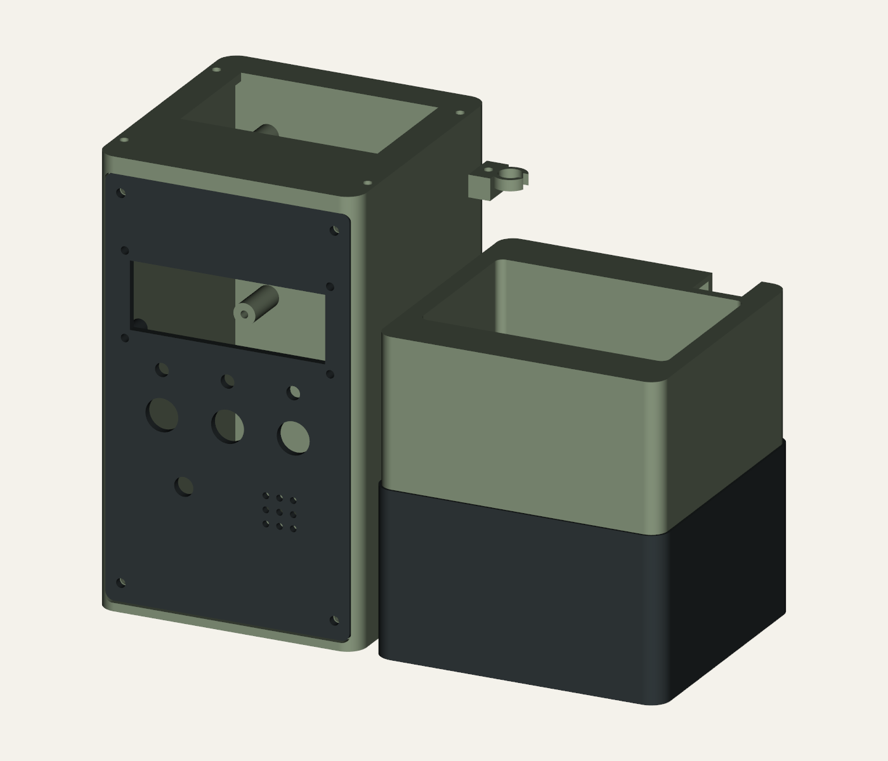

# ESP32 Plant Station

A compact, manual-dose ESP32 plant-watering prototype with a printable enclosure, removable planting compartment and lower pump sump.

**Current mechanical revision: R7, 12 September 2026. Corrected carrier and LCD mounts, LCD aperture and top USB access. Prototype: actual hardware fit remains unverified.**



## Downloads

- [R7 illustrated assembly guide (PDF)](output/pdf/Plant_Station_R7_Illustrated_Assembly_Guide.pdf) and [online guide](docs/ASSEMBLY_GUIDE_R7.md).
- [Complete R7 illustrated review pack (ZIP)](ESP32_Plant_R7_Illustrated_Review.zip).
- [Seven assembly STLs and three fit coupons](mechanical/concept_rev7/stl/), [STEP solids](mechanical/concept_rev7/step/), [assembly STEP](mechanical/concept_rev7/assembly.step) and [editable CAD source](mechanical/concept_rev7/build.py).
- [Dimensions, assumptions and print guidance](mechanical/concept_rev7/README.md), [dimensional sources](mechanical/concept_rev7/references/SOURCES.md).
- Historical packages: [R6](ESP32_Plant_R6_Illustrated_Review.zip), [R5](ESP32_Plant_R5_Review.zip). Their mounting and USB geometry is superseded by R7.

## Design

- Left-hand dry electronics tower; overall assembly 207 × 100 × 161 mm.
- SunFounder reference board 67 × 64 mm; mounting centres **60 × 57 mm**. Both USB ports face upwards into a shared **72 × 46 mm** opening.
- Supplied LCD reference: PCB 80 × 36 mm, mounting centres **75 × 31 mm**, 3 mm holes. Fascia aperture **71.4 × 24.6 mm** clears the 71 × 24.2 mm bezel with a nominal 0.2 mm per side.
- Three nominal **12 mm** button holes. Separate carrier, LCD and button fit coupons are supplied.
- R6 sump retained: 60 mm external height / 56 mm internal depth; provisional pump envelope 38.5 × 25.5 × 43 mm. Planting cavity 90 × 60 × 50 mm with two 6 mm drains.

Print the fit coupons first. Port offsets, plug dimensions, carrier stack and LCD depth remain assumptions requiring measurement. The broad USB service opening is unsealed and requires cable strain relief.

STLs use millimetres and common assembly coordinates. Load together without auto-arranging to inspect the assembly; orient and place each part on the bed before slicing. R7 replaces the tower, fascia and top cover; the sump, planter, battery tray and hose clip retain R6 geometry.

## Verification

Ten exported meshes are closed, consistently wound, positive-volume single components. All 21 assembled CAD part-pair intersections are zero within the recorded threshold. Independent exported sections check carrier/LCD centres, holes, LCD aperture and USB opening. See [CAD verification](mechanical/concept_rev7/verification.json), [independent mesh checks](mechanical/concept_rev7/independent_mesh_check.json) and [documentation QA](docs/R7_DOCUMENTATION_QA.md).

The CAD runtime printed PASS then exited with code 1 during shutdown; independent export checking exited successfully with code 0. Actual component fit, strength, watertightness and electrical operation are not established by these checks. The supplied carrier pinout remains unverified.

## Firmware

[Source and build instructions](firmware/README.md) implement one bounded manual timed dose per WATER press. Proposed STOP and LAMP TEST cancel the dose. Moisture is advisory; no automatic watering is implemented.

The pump output is disabled by default. The firmware uses an explicitly selected classic ESP32 compile-review profile, not an approved pin map for the actual SunFounder camera carrier. LCD text output is not implemented, and the probe path still needs I2C initialisation. Camera functionality, battery charging and wet operation are not validated.

Review compilation against ESP32 Arduino core 2.0.17 used 272,957 bytes flash and 21,944 bytes global RAM. No hardware upload was performed for R5.

## Rebuilding the artefacts

The CAD source uses Python, CadQuery 2.8, trimesh, NumPy and VTK. The PDF source uses ReportLab. Install dependencies in an isolated environment; local bundled runtimes are not included in this repository.

```powershell
python mechanical/concept_rev7/build.py
python mechanical/concept_rev7/check_exports.py
python scripts/build_guide_r7.py
python scripts/package_r7_illustrated.py
```

Read the firmware README and PDF before compiling or attempting an upload. Confirm the exact board revision and GPIO reservations first; even a pump-disabled build configures other pins as outputs.

## Project records

[Requirements and unknowns](docs/PROJECT_CONTROL.md), [electronics notes](docs/ELECTRONICS.md), and [provisional BOM](docs/BOM.md) retain the original engineering context. R7 mechanical notes and guide supersede older mechanical dimensions and fitting placeholders in those records. Dimensional reference images are included with attribution; local build tools are excluded.

Next steps: measure the actual components, validate the carrier-specific pin map, print fit trials, review slicing, and complete dry electrical and controlled leak/flow tests.
