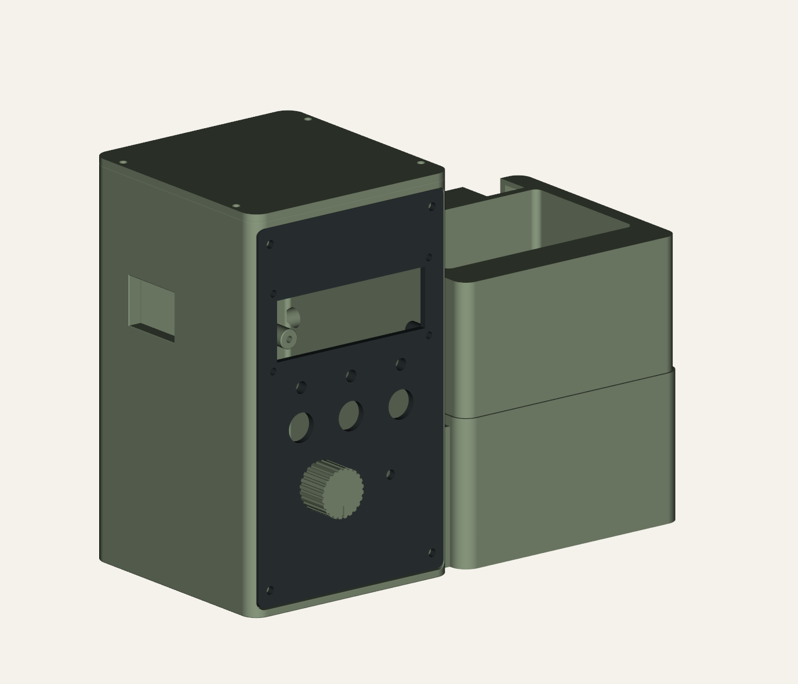

# ESP32 Plant Station

A compact, manual-dose ESP32 plant-watering prototype with a printable enclosure, removable planting compartment and lower pump sump.

**Current mechanical revision: R11, 13 September 2026. One continuous tower/sump/battery-saddle body, wall-supported cable riser and a transverse battery tie slot. Physical fit, cable bending and water level remain unverified.**



## Downloads and interactive explorer

- [R11 STL/STEP mechanical package](ESP32_Plant_R11_Mechanical_Review.zip).
- [R11 geometry and revised assembly guidance](mechanical/concept_rev11/README.md).
- [R11 STL files](mechanical/concept_rev11/stl/), [STEP solids](mechanical/concept_rev11/step/) and [assembly STEP](mechanical/concept_rev11/assembly.step).
- [Interactive exploded explorer instructions](mechanical/concept_rev11/viewer/README.md).
- [Cable route section](mechanical/concept_rev11/cable_section.png).
- [R8 illustrated guide](output/pdf/Plant_Station_R8_Illustrated_Assembly_Guide.pdf) remains applicable to controls and electronics; R11 guidance supersedes its separate tower/sump assembly and cable route.

## R11 design and verification

The combined body is 207 × 100 × 158 mm; assembled height with roof remains 161 mm. Five main printable parts; the separate battery tray is integrated. The planter has local clearance for the supported riser and remains removable. The rejected long trough has been removed. Other R9 controls, mounting patterns, roof, hose clip and knob alternatives are retained.

The provisional 4 mm cable rises on the sump side and crosses through the supported riser at a minimum opening height of z77 mm, 17 mm above the z60 mm sump rim. There is no below-rim opening in the wet/dry wall. Maximum fill level, actual cable diameter, connector and bend radius remain unknown; the route is not a waterproof gland.

20 exported meshes pass independent checks. Reopened STEP parts are valid single solids; the assembly contains five solids. All 10 main-part intersections are zero within the recorded tolerance. Material probes confirm continuity and the retained sump wall; route probes are clear. The integrated holder saddle has a 6 x 2.5 mm tie slot for a provisional 4.8 x 1.5 mm tie. Planter lift checks at 2 mm increments through 120 mm are clear. See [verification records](mechanical/concept_rev11/REVISION_CHECKS.md). The known CadQuery shutdown exit 1 is separate from passing assertions; the independent mesh checker exits 0.

Print preparation, support removal, actual cable fit, strength and controlled leak/flow tests remain outstanding. Historical packages: [R9](ESP32_Plant_R9_Mechanical_Review.zip), [R8](ESP32_Plant_R8_Illustrated_Review.zip).

## Firmware

[Source and build instructions](firmware/README.md) implement one bounded manual timed dose per WATER press. Proposed STOP and LAMP TEST cancel the dose. Moisture is advisory; no automatic watering is implemented.

The pump output is disabled by default. The firmware uses an explicitly selected classic ESP32 compile-review profile, not an approved pin map for the actual SunFounder camera carrier. LCD text output is not implemented, and the probe path still needs I2C initialisation. Camera functionality, battery charging and wet operation are not validated.

Review compilation against ESP32 Arduino core 2.0.17 used 272,957 bytes flash and 21,944 bytes global RAM. No hardware upload was performed for R5.

## Rebuilding the artefacts

The CAD source uses Python, CadQuery 2.8, trimesh, NumPy and VTK. The PDF source uses ReportLab. Install dependencies in an isolated environment; local bundled runtimes are not included in this repository.

```powershell
python mechanical/concept_rev8/build.py
python mechanical/concept_rev8/check_exports.py
python mechanical/concept_rev8/check_step.py
python scripts/build_guide_r8.py
python scripts/package_r8_illustrated.py
```

Read the firmware README and PDF before compiling or attempting an upload. Confirm the exact board revision and GPIO reservations first; even a pump-disabled build configures other pins as outputs.

## Project records

[Requirements and unknowns](docs/PROJECT_CONTROL.md) and [electronics notes](docs/ELECTRONICS.md) retain the engineering context. [Current R8 BOM](docs/BOM_R8.md), mechanical notes and guide supersede older mechanical dimensions and fitting placeholders. Dimensional reference images are included with attribution; local build tools are excluded.

Next steps: measure the actual components, validate the carrier-specific pin map, print fit trials, review slicing, and complete dry electrical and controlled leak/flow tests.
