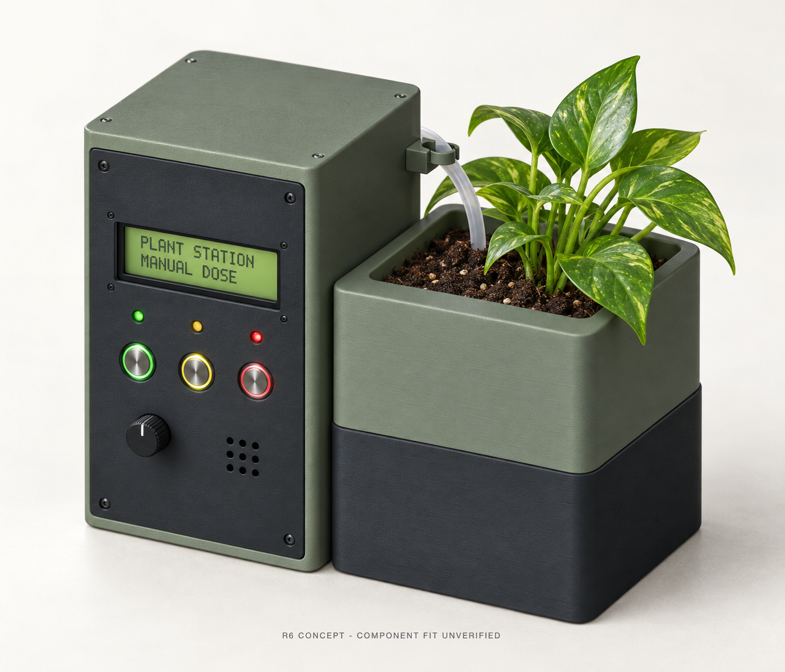
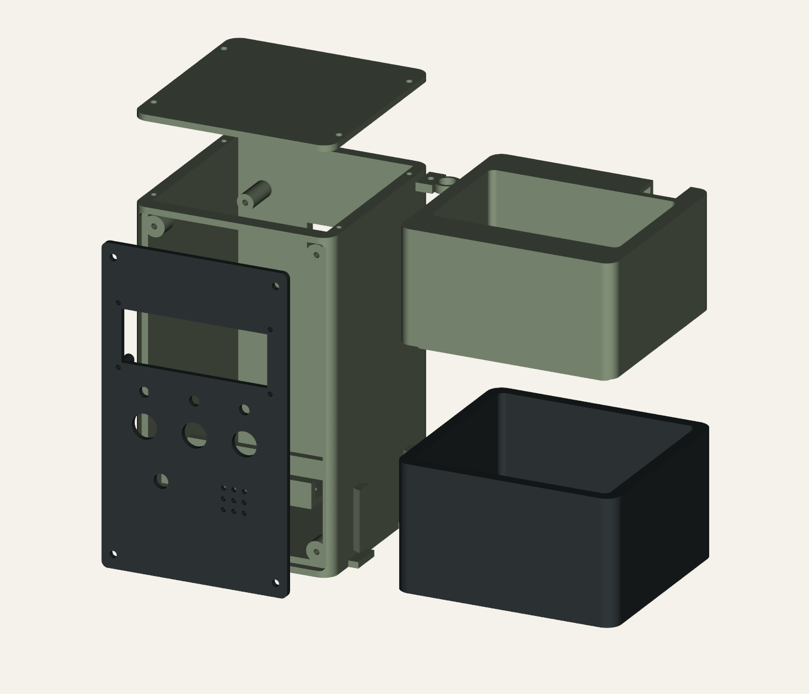
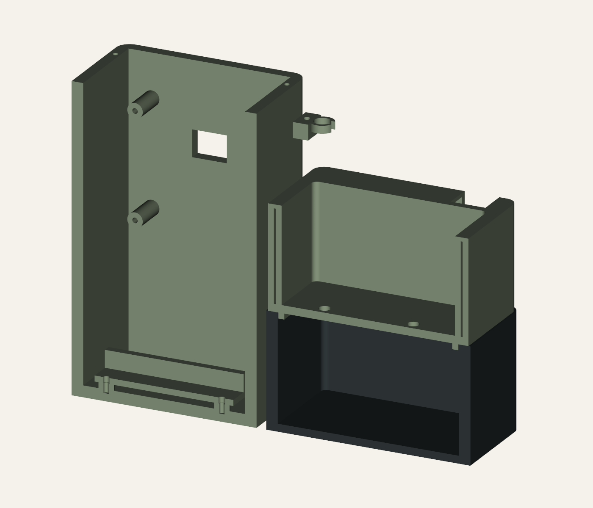

# Plant Station R6 - Illustrated assembly guide

11 September 2026 | Document R6-A1 | Units: mm | Provisional hardware fit

**Mechanical authority:** R6 CAD and verification records. Concept art is an appearance illustration. This guide does not enable hardware or change the STLs.

## Plant Station / R6

Concept appearance and illustrated assembly | Seven printed parts plus fit coupon

Generated R6 concept illustration; not a dimensional drawing or operational demonstration.

<b>Updated design:</b> 60 mm-high sump, three 12 mm button bores, 8.4 mm hose clip and an open rear hose/cable route. The planting cavity and measured LCD/ESP32 mounting centres are preserved.

<b>Read the illustration correctly.</b> The plant, LCD text, illuminated button rings, indicator colours and tube shape are illustrative. LCD text output is not implemented in the current firmware. Do not use the picture for dimensions, pin assignments or minimum water level.

<b>Build status:</b> CAD and exported meshes checked. Actual pump, switch nut/body fit, printing process, leak containment and electrical operation remain unverified. Dimensions in the following pages take precedence over appearance proportions.

For an existing R5 build, replace the <b>sump, planter and hose clip</b> together. The tower, fascia, top cover and battery tray have unchanged STL hashes.

## 02 / Parts and arrangement

Assembly geometry from the exported CAD; the exploded spacing is illustrative.

R6 exploded CAD view: top lid, front fascia, tower, holder tray, planter, sump and hose clip.

| Part / quantity | Role and R5 replacement |
| --- | --- |
| tower_sage / 1 | Dry enclosure with rear PCB standoffs; retain R5. |
| fascia_charcoal / 1 | LCD, three buttons, LEDs, potentiometer and grille; retain R5. |
| top_cover_sage / 1 | Removable dry-enclosure lid; retain R5. |
| sump_charcoal / 1 | 60 mm-high pump reservoir; replace R5. |
| planter_sage / 1 | Removable soil compartment with two drains; replace R5. |
| battery_tray / 1 | Insulated-holder support; retain R5. |
| hose_clip / 1 | 8.4 mm bore, external routing; replace R5. |
| button_fit_coupon / 1 test piece | 12.0 / 12.2 / 12.4 mm holes; not part of final assembly. |

Import assembly STLs as <b>millimetres</b>, keeping common coordinates and disabling auto-arrange for inspection. For printing, orient each part and place it on the bed. No slicer profile or universal support/temperature settings are specified.

## 03 / Interfaces and fit coupon

Datum: x right, y rear, z up; origin at the tower front-left-bottom corner.

| Interface | Nominal geometry | Evidence / allowance |
| --- | --- | --- |
| Overall assembly | 207 x 100 x 161 | CAD envelope, excluding plant and external tubing |
| Sump main body | 106 x 100 x 60; floor 4 | 56 internal depth; footprint excludes dovetail collar |
| Planting cavity | 90 x 60 x 50; two drains dia. 6 | CAD nominal; not a recommended fill volume |
| Button bores | 3 x dia. 12.0, 24 mm centres | User-specified holes; fascia thickness 3 |
| Button rear space | Nut dia. 20; rear depth 35 | Assumed: first 5 mm nut space, then dia. 16 |
| LCD | 70 x 25 aperture; 73 x 30 centres | Preserved user measurements |
| ESP32 carrier | 60 x 55 mounting centres | Preserved user measurements |
| Hose clip | 8.4 bore for nominal 8 OD tube | 0.4 diametral allowance; retention untested |

<b>Step 1 - Establish insert fit.</b> Print the 3 mm-thick coupon first. The corner notch marks the 12.0 mm end; the next holes are 12.2 and 12.4 mm. Test the actual threaded body, sealing washer and nut. The fascia remains 12.0 mm nominal: do not scale the complete fascia to compensate for one hole.

<b>Step 2 - Check rear space.</b> Measure body depth including terminals and wire bends, nut diameter, permitted panel thickness and thread engagement. Confirm the nut tool can reach without disturbing adjacent inserts. If the 20 mm/35 mm envelopes are exceeded, revise the CAD before full printing.

<b>Photo limitation:</b> the purchase screenshot shows red/green/yellow ring styles but not the selected momentary/latching action or LED voltage. Those are electrical identification checks, not facts established by the 12 mm hole size.

## 04 / Assemble the wet module

Keep electrical parts disconnected during dry fitting and water-containment checks.

R6 CAD section exposing sump floor, planting floor and drain paths; pump not depicted.

<b>Step 3 - Trial-fit the pump.</b> Reference body: 38.5 L x 25.5 W x 43 H mm, upright on the sump floor. CAD checks include 3 mm lateral/top allowance. The body has 13 mm to the main planter underside; the peripheral lip level is 10 mm above it. Add the real outlet, feet and cable bends to the envelope.

<b>Step 4 - Route the tube.</b> Fit tubing to the pump outlet and lead it through the 18 mm rear service notch. Route the cable beside it without pinching. The open notch is outside the soil cavity; protect its edges and maintain a drip loop before any dry-enclosure entry. Fit the external clip without crushing the tube.

<b>Step 5 - Make it serviceable.</b> Use actual pump-compatible removable retention and inlet screening. No specific suction-foot mount is modelled. Fit removable debris guards over both drains; keep both paths open and accessible. A liner or coating must not close them.

<b>Step 6 - Close and test.</b> Lower the planter onto its locating lip with no trapped hose/cable. Test the empty wet module over a tray for leaks and drain-back overflow before adding soil or electronics. Establish a measured maximum fill level below the soil floor and an operating minimum above the pump requirement.

<b>Step 7 - Couple the modules.</b> Slide the sump collars onto the tower dovetails from above, keeping the bases level. Do not force the joint. It is not a carrying lock: support both modules when moving the assembly.

## 05 / Assemble the dry module

Fit components with the fascia and top cover removed; all power disconnected.

<b>Step 8 - Fit the LCD to the fascia.</b> Use the four 2.4 mm bores and 8 mm standoffs. M2 through-fixings are provisional; keep screw-head diameter at or below 4 mm near the aperture. Select length from the actual stack and nut engagement. Do not enlarge bosses or bow the LCD PCB.

<b>Step 9 - Fit the controls.</b> Insert the three 12 mm buttons from the front; install their supplied washers/nuts inside. Add LEDs, potentiometer and sounder using measured fittings. Do not apply a guessed metal-panel tightening torque to printed plastic. Keep the wiring serviceable.

<b>Step 10 - Fit the board and holder.</b> Check the SunFounder revision and underside components before using the 60 x 55 mm mount. Fit an insulated cell holder to the tray, then the tray to the floor pads; the tray is not a bare-cell contact system. Leave the cell disconnected.

<b>Step 11 - Arrange the harness.</b> Keep pump current wiring out of the GPIO circuit and separated from the wet module. Provide strain relief and insulating mounts for any driver/level-shifter boards. Check real PCB/LCD projections; the existing envelope assumptions do not include every connector.

<b>Step 12 - Close for inspection.</b> Fit the fascia and top cover only after checking wiring clearance, USB cable insertion, switch nut clearance and fastener length. Open the covers again if a wire is compressed. Confirm both covers can be removed for service.

| Fastening point | CAD geometry / practical check |
| --- | --- |
| LCD x4 | 2.4 through-bore; provisional M2; maximum head dia. 4 |
| Rear board x4 | 2.8 pilot; confirm screw and board bore; do not bottom out |
| Fascia x4 / lid x4 | 3.4 clearance / 2.8 pilot; select length from actual engagement |
| Holder tray x2 / hose clip x1 | 3.4 clearance / 2.8 pilot; clip blind pilot is only 3 deep |

No heat-set inserts or validated installation torques are specified. Start screws square and verify retention on a separate printed sample. The existing LCD boss-to-aperture margin is small (approximately 0.415 mm).

## 06 / Electrical assembly boundary

Logical relationships only - this is not a physical SunFounder pinout or a ready-to-wire schematic.

Logical chain: controls -> ESP32 -> outputs; pump supply -> protected MOSFET driver -> pump. ESP32 commands the driver. Actual wiring, power path and common ground require a verified schematic.

<b>Step 13 - Identify before wiring.</b> Match the carrier revision, reserved camera/SD pins, cell and connectors. The candidate carrier includes charging and a 5 V converter, but allowable pump startup load and simultaneous USB/battery operation are unresolved. Do not use the classic DevKit compile-review pin map as a physical wiring plan.

<b>Step 14 - Verify interfaces.</b> Keep ESP32 signals within their 3.3 V limits. If the LCD backpack pulls I2C to 5 V, fit suitable bidirectional translation. Each separate LED needs its own resistor. Verify the purchased button-ring LED voltage/polarity and switching action. Supply a sounder through an appropriate driver.

<b>Step 15 - Verify pump shutdown.</b> Use the measured pump voltage and startup current to select supply, driver, suppression, fuse and cable. A 4.5 V nominal pump listing is not proof of 5 V compatibility. Check default-OFF hardware and common-ground routing against the final schematic; never drive the pump from GPIO.

<b>Current firmware:</b> manual timed dose only. WATER captures the dose setting once; releasing WATER does not end that dose. STOP and LAMP TEST cancel it. Release/re-arm is required. Moisture is advisory. Duration is not calibrated volume. LCD text, button illumination and actual hardware operation are not demonstrated by the concept art.

Start with unpowered assembly checks. Keep the pump disconnected until board-specific configuration and dry output tests are complete. No upload or powered test is performed by this documentation update.

## 07 / Acceptance worksheet

Record evidence against the actual built unit. An unchecked row remains open.

Unit / build ID: ____________________  Date: _______________ Pump model: _____________________  Switch variant: _____________________ Printer / material / profile: __________________________________________

| Check | Acceptance / evidence to record | Result |
| --- | --- | --- |
| A1 Insert coupon | Body fits; nut/washer seats on 3 mm panel; thread and tool access adequate | ____ |
| A2 Pump envelope | Body, outlet, feet and cable clear planter and notch without force | ____ |
| A3 Reservoir | Leak test method/duration recorded; no leakage; drains clear | ____ |
| A4 Water levels | Measured max fill permits drain-back; operating min satisfies pump | ____ |
| A5 Tube route | No kink/pinch; barb and clip retain tube; outlet stays above soil | ____ |
| A6 Dry enclosure | No crushed wires; insulated mounts; USB and cover access retained | ____ |
| A7 Board/switch ID | Carrier pins, button action and ring LED ratings verified | ____ |
| A8 Dry output test | Reset/boot/STOP/lamp test do not create unintended pump command | ____ |
| A9 Supervised wet test | Startup voltage/current and driver temperature acceptable to ratings | ____ |
| A10 Dose calibration | Installed flow and repeatability measured; no assumed ml scale | ____ |

<b>Measured values</b> Pump running / startup current: __________ / __________ A Supply minimum during startup: __________ V Maximum / minimum reservoir level datum: __________________________ Dose duration / delivered volume / repeats: __________________________

Outstanding defects / corrective action: __________________________________ __________________________________________________________________ Checked by: __________________________  Date: ______________________

## 08 / Evidence and revision record

Document R6-A1; assembly instructions supplement the retained source files.

| Evidence | Recorded result / limitation |
| --- | --- |
| R6 CAD | Seven valid solids; 21 assembly pair checks with zero overlap to 0.00001 mm3; positive overlap control 500 mm3 |
| Exported meshes | Eight STLs: closed, consistent winding, one component, positive volume, two faces per edge, no degenerate faces |
| Interface checks | Button/coupon exported cross-sections; sump height; CAD pump/button envelopes, passage and mount probes |
| Visual checks | CAD assembly/section and generated appearance reviewed; appearance is not metrology |
| Runtime limitation | CAD builder printed PASS then returned code 1 on shutdown; independent mesh checker returned success |
| Not established | Physical fit, self-intersection exhaustion, slicer/material/process approval, leak strength, electrical operation |

<b>Controlled references</b> <a href="https://github.com/skyhigh6/esp32-plant-station/blob/c55245268ba7ca4d52b92bf4e17ad9b4ed3e6a8b/mechanical/concept_rev6/README.md" color="#315f4c">R6 dimension contract and assembly notes</a> <a href="https://github.com/skyhigh6/esp32-plant-station/blob/c55245268ba7ca4d52b92bf4e17ad9b4ed3e6a8b/mechanical/concept_rev6/verification.json" color="#315f4c">CAD verification record</a> <a href="https://github.com/skyhigh6/esp32-plant-station/blob/c55245268ba7ca4d52b92bf4e17ad9b4ed3e6a8b/mechanical/concept_rev6/independent_mesh_check.json" color="#315f4c">Independent mesh verification record</a> <a href="https://github.com/skyhigh6/esp32-plant-station/blob/c55245268ba7ca4d52b92bf4e17ad9b4ed3e6a8b/mechanical/concept_rev6/build.py" color="#315f4c">Editable CAD source</a> <a href="https://github.com/skyhigh6/esp32-plant-station/blob/c55245268ba7ca4d52b92bf4e17ad9b4ed3e6a8b/firmware/README.md" color="#315f4c">Firmware scope and commissioning limits</a> <a href="https://github.com/skyhigh6/esp32-plant-station/blob/c55245268ba7ca4d52b92bf4e17ad9b4ed3e6a8b/docs/ELECTRONICS.md" color="#315f4c">Electronics design notes</a>

<b>Revision R6-A1 / 11 September 2026.</b> Added generated R6 concept art, current part list, illustrated wet/dry assembly sequence, insert coupon guidance, logical electrical boundary and acceptance worksheet. No STL geometry or firmware changes. This guide supersedes R5 mechanical assembly illustrations; retain R5 for history.

<b>Source hierarchy:</b> user measurements and exact component drawings, then controlled CAD and verification records, then assembly guidance. Appearance art is last. Record any measured deviation before altering the model. The art was generated with the built-in image tool from the R6 CAD assembly reference; prompt and review notes are stored with the art.
