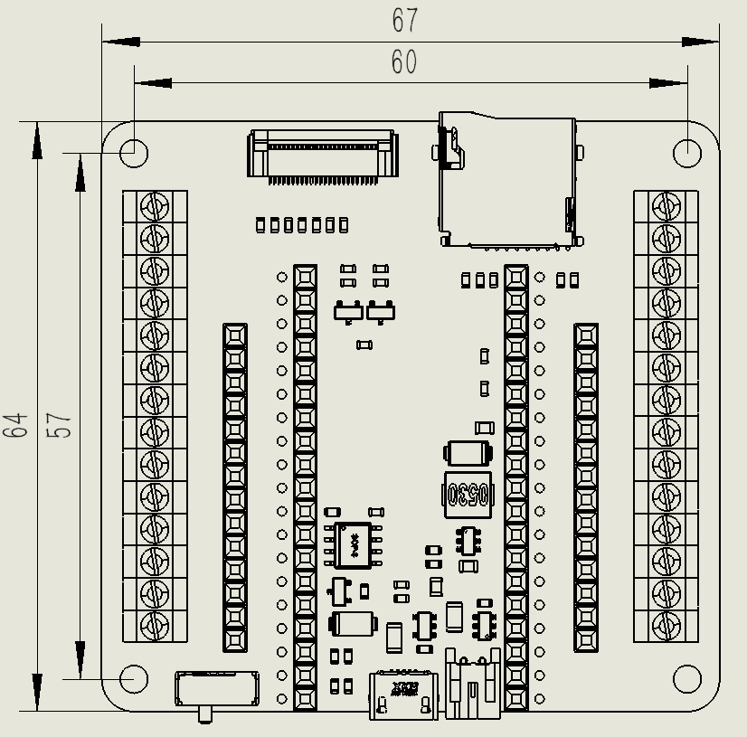
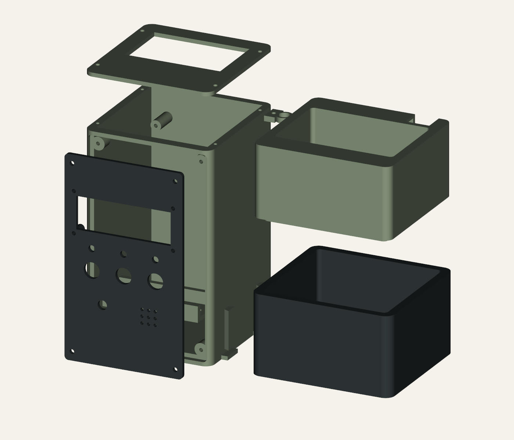

# Plant Station R7 - Illustrated assembly guide

12 September 2026 | R7-A1 | Units: mm

R7 supersedes the R6 tower, fascia and top cover. Actual physical fit remains unverified.

## Plant Station / R7

Corrected carrier and LCD interfaces | USB access through the top cover

R7 exported CAD assembly. The shared top opening replaces the rear USB window.

<b>Corrected:</b> SunFounder carrier mounting centres 60 x 57; LCD mounting centres 75 x 31; LCD aperture 71.4 x 24.6; LCD fixing bores 3.0. Both USB ports face upwards into a 72 x 46 shared top access opening.

<b>Replace from R6:</b> tower_sage, fascia_charcoal and top_cover_sage. Retain the sump, planter, battery tray, hose clip and button coupon. Seven assembly parts plus three test coupons are supplied.

<b>Evidence:</b> the manufacturer carrier drawing and the main annotated LCD drawing supplied by the user supersede the earlier 60 x 55 and 73 x 30 measurements for R7. They do not prove that the physical units match. Print the two interface coupons before the enclosure.

R6 generated concept art is retained as historical appearance only; it does not depict this top opening or the corrected LCD mount. This guide uses R7 CAD geometry. No firmware, printer operation or powered test is included.

## 02 / Drawing corrections

Explicit annotations are used; no dimensions are estimated from image pixels.

SunFounder carrier dimension drawing: 67 x 64 PCB and 60 x 57 mounting centres.

<b>Carrier source drawing</b> 67 x 64 PCB outline 60 x 57 hole centres  The USB edge is at the bottom of this drawing. Install rotated 180 degrees in the PCB plane so both USB connectors face up.  The source does not specify mounting-hole diameter, connector offsets or stack height.

| Interface | Earlier R6 | R7 basis |
| --- | --- | --- |
| Carrier mount centres | 60 x 55 | 60 x 57 - SunFounder drawing |
| LCD mount centres | 73 x 30 | 75 x 31 - primary user image |
| LCD board / bores | 80 x 36 assumed / 2.4 | 80 x 36 reference / 3.0 nominal |
| LCD aperture | 70 x 25 | 71.4 x 24.6 = bezel plus 0.2 per side |
| LCD visible area | Not a cutout datum | 64.4 x 14.5 reference only |

<b>LCD image interpretation:</b> 71 x 24.2 is the bezel envelope; 64.4 x 14.5 is the optical viewing area. The 80 x 36 PCB and 75 x 31 hole pattern are separate dimensions. The smaller thumbnails show other module variants and are not used.

<b>First operation:</b> print carrier_fit_coupon and lcd_fit_coupon. Check the real mounting centres and bezel fit without force. The carrier coupon has 2.8 mm holes matching the pilot pattern; it does not establish the carrier PCB hole diameter.

## 03 / Orientation and USB access

Component face towards removable fascia; charging and programming are separate USB ports.

Carrier outline in enclosure: x = 14.5 to 81.5 z = 76.5 to 140.5  Mount centres x,z: (18,80), (78,80) (18,137), (78,137)  Seating plane y = 76 Vertical centres = 57

Installed carrier: both USB ports up, component face towards fascia; mount centres (18,80), (78,80), (18,137), (78,137), seating plane y=76.

<b>Top opening:</b> x = 12 to 84, y = 40 to 86, through the 3 mm cover at z = 158 to 161. The 72 x 46 opening deliberately spans the top connector region. The former rear-wall opening is closed because rearward insertion was not aligned with the PCB edge.

<b>What was checked:</b> a broad 67 x 38 vertical passage above the carrier clears the printed assembly. The central lower entry also clears the mounting bosses. This checks open access geometry, not the exact socket centre or plug engagement depth.

<b>Trial assembly:</b> fit the carrier with both USB ports up, leaving power disconnected. Trial-insert each real cable separately. Check plug overmould, insertion length, cable bend and cover removal. Keep the charge and programming connectors correctly identified. Their offsets and installed module height remain unmeasured.

<b>Trade-off:</b> broad access avoids invented tight-fit port locations, but leaves a large open top. It has no splash seal or strain relief. Keep water tubing outside the dry tower. A smaller fitted cable insert needs actual connector and cable measurements.

## 04 / Assemble the wet module

R6 sump and planter geometry is retained; do not mix it with the shorter R5 set.

R7 exploded assembly; separation distances are illustrative.

<b>1 - Prepare and trial-fit.</b> Print the interface coupons, then the required parts. Import STLs as millimetres. Keep assembly coordinates for inspection; orient and place each individual part on the print bed for slicing. Printer, material and slicer settings remain unverified.

<b>2 - Fit the pump and hose.</b> Sump is 60 mm externally, 56 mm internally, with 4 mm floor. Reference pump body is 38.5 x 25.5 x 43, not a measured unit. Check outlet, feet and cable against the remaining space. No model-specific retention mount is supplied.

<b>3 - Route and screen.</b> Lead the nominal 8 mm OD tube and pump cable through the rear 18 mm service notch. Use the external 8.4 mm clip without crushing the tube. Add removable inlet/debris screens; retain exactly two open 6 mm drains. Leave access for cleaning.

<b>4 - Close and leak-test.</b> Seat the planter lip without pinching the hose. Test the wet module over a tray before installing electronics. Establish maximum fill with drain-back headspace and minimum fill from the actual pump submersion requirement. No untested fill volume is prescribed.

<b>5 - Join the modules.</b> Slide sump collars onto tower dovetails from above, align bases and avoid forcing the fit. The joint is not a carrying lock: support both modules when moving the build.

## 05 / LCD and dry assembly

Use corrected fascia and tower together; keep the battery and all external supplies disconnected.

| Interface / location | R7 nominal and assembly check |
| --- | --- |
| LCD PCB / aperture | 80 x 36 board; 71.4 x 24.6 aperture at x=12.3, z=100.2 |
| LCD hole centres x,z | (10.5,97), (85.5,97), (10.5,128), (85.5,128) |
| LCD mounting pads | 6 OD / 3.0 bore; face y=12; 8 mm stand-off from fascia rear |
| LCD fasteners | Provisional M2.5 or smaller; head OD <=5.5; verify real PCB bores |
| Carrier standoffs | 8 OD / 2.8 blind pilots; face-to-rear-wall space 18 |
| Assumed depth envelopes | Carrier stack 31.6 towards front; LCD rear stack 21.6; gap 10.8 |
| Button inserts | 3 x 12 bores; 24 centres; 3 thick panel; nut/body clearances still provisional |

<b>6 - Fit the LCD.</b> Use the LCD coupon to check the bezel and hole pattern first. Trial-fit the fascia with the actual module and backpack. The 8 mm stand-off depth is not provided by the image: verify bezel-to-PCB projection before tightening. Do not load the glass, bow the PCB or use oversized washers near the aperture.

<b>7 - Fit controls and carrier.</b> Fit the button inserts from the front, retaining nuts inside. Verify body depth, ring voltage and momentary/latching action separately. Fit the carrier USB-edge-up, then the insulated battery holder and tray. The tray is not a bare-cell contact system.

<b>8 - Harness and close.</b> Mount driver/translator boards on insulation, provide service loops and strain relief, and keep pump current out of GPIO wiring. Select every screw from actual engagement depth; the clip pilot is only 3 mm deep. Check USB access, then fit fascia and cover without trapping wires.

Screw retention, tightening torque and physical stack clearance are not validated. R7 supersedes earlier LCD 2.4 mm fixing guidance and the old 73 x 30 mounting pattern.

## 06 / Commissioning and acceptance

Record measured evidence. These checks are not completed by generating the files.

Build ID: _____________________ Date: _______________ Carrier revision: ______________ LCD model: _______________ Pump model: __________________ Switch variant: _______________

| Check | Acceptance / evidence to record | Result |
| --- | --- | --- |
| A1 Carrier coupon | 60 x 57 centres match actual PCB; screws clear underside parts | ____ |
| A2 LCD coupon | 75 x 31 pattern and aperture fit; actual rear/front depths measured | ____ |
| A3 USB access | Both real cables insert independently; no shell contact or wire trap | ____ |
| A4 Buttons / covers | Nuts and harness clear; fascia and lid removable for service | ____ |
| A5 Wet module | No leaks; both drains clear; safe min/max levels recorded | ____ |
| A6 Interfaces | Carrier pins, LCD I2C voltage, switch action and LED ratings verified | ____ |
| A7 Dry output test | Boot/reset/STOP/lamp-test produce no unwanted pump command | ____ |
| A8 Supervised wet test | Pump startup voltage/current, driver temperature and flow recorded | ____ |

<b>Electrical boundary:</b> no physical pin map is approved by this revision. Keep the pump disconnected until carrier-specific pin allocation and default-OFF driver behaviour are checked. ESP32 GPIO must not receive 5 V signals. LCD pull-ups at 5 V require suitable I2C translation. Do not infer pump-supply capacity from the charger current rating.

<b>Firmware remains manual-only.</b> WATER captures a timed dose setting once; releasing WATER does not cancel the dose. STOP and LAMP TEST cancel it. Duration is not calibrated volume. LCD text and ring illumination remain unverified/unimplemented as previously documented; there is no automatic watering.

Pump running/startup current: __________ / __________ A Minimum supply during start: ______ V  Dose duration/volume: ______________ Defects / action: ___________________________________________________

## 07 / Evidence and sources

R7-A1 / 12 September 2026 | Refer to the source drawings before altering fit dimensions.

| Evidence | Result / boundary |
| --- | --- |
| CAD geometry | Seven valid single-body assembly parts; 21 pair intersections zero to 0.00001 mm3; positive overlap control 500 mm3 |
| Exported meshes | Ten single-component, closed, consistently wound STLs; positive volume, two faces per edge, no degenerate faces |
| Measured exports | Cross-sections check carrier/LCD/button holes and centres, LCD aperture and top opening; sump height retained |
| Design assumptions | LCD standoff depth, carrier/module stack, fasteners, cable overmoulds and actual component identity |
| Runtime note | CAD builder printed PASS then exited 1 on shutdown; independent exported-mesh checker succeeded |
| Unperformed | Physical fit, slicing, strength/leak testing, full self-intersection analysis, powered commissioning |

<b>References</b> <a href="https://docs.sunfounder.com/projects/esp-cam-kit/en/latest/component_esp32_extension.html" color="#315f4c">SunFounder component page</a> <a href="https://docs.sunfounder.com/projects/esp-cam-kit/en/latest/_images/esp32_camera_extension_size.png" color="#315f4c">SunFounder dimensioned drawing</a> <a href="https://github.com/skyhigh6/esp32-plant-station/blob/main/mechanical/concept_rev7/README.md" color="#315f4c">R7 dimensional contract</a> <a href="https://github.com/skyhigh6/esp32-plant-station/blob/main/mechanical/concept_rev7/verification.json" color="#315f4c">R7 CAD verification</a> <a href="https://github.com/skyhigh6/esp32-plant-station/blob/main/mechanical/concept_rev7/independent_mesh_check.json" color="#315f4c">R7 exported-mesh verification</a> <a href="https://github.com/skyhigh6/esp32-plant-station/blob/main/firmware/README.md" color="#315f4c">Firmware boundary</a>

LCD source: primary annotated drawing in the user-supplied screenshot. Reference copy and source register are included under mechanical/concept_rev7/references. It is not an identified part-number datasheet. Explicit annotations are adopted; dimensions of unrelated thumbnails are excluded.

<b>Revision change:</b> R6 had the wrong vertical carrier spacing, LCD pattern and rear-facing USB access. R7 corrects them using the supplied evidence, closes the rear opening and provides broad top access. Earlier measurements remain in historical revisions. Wet parts and three 12 mm button holes are retained.
