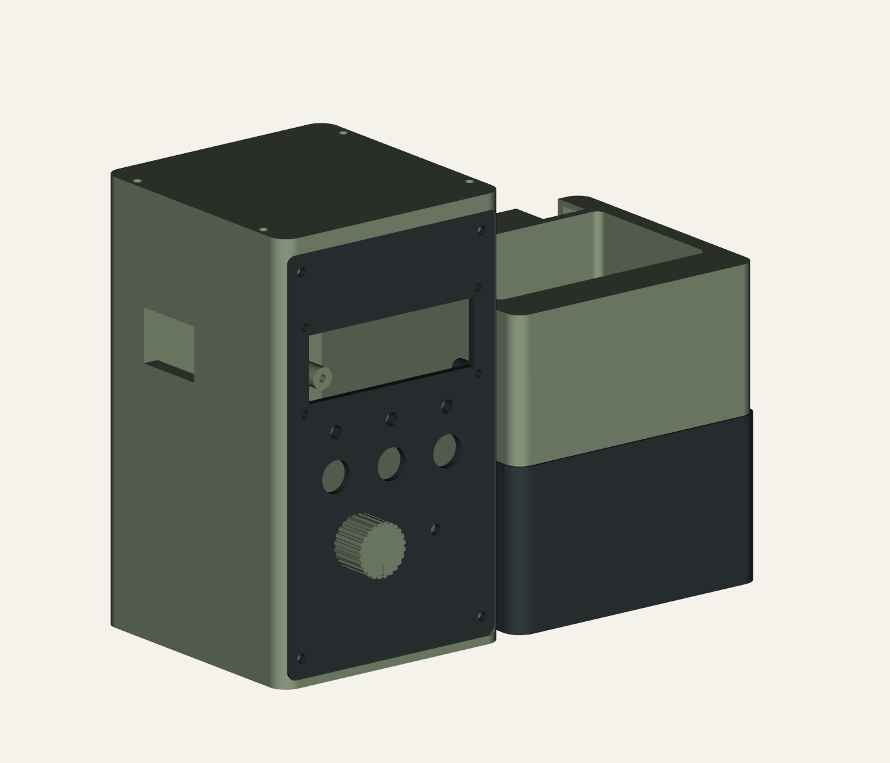
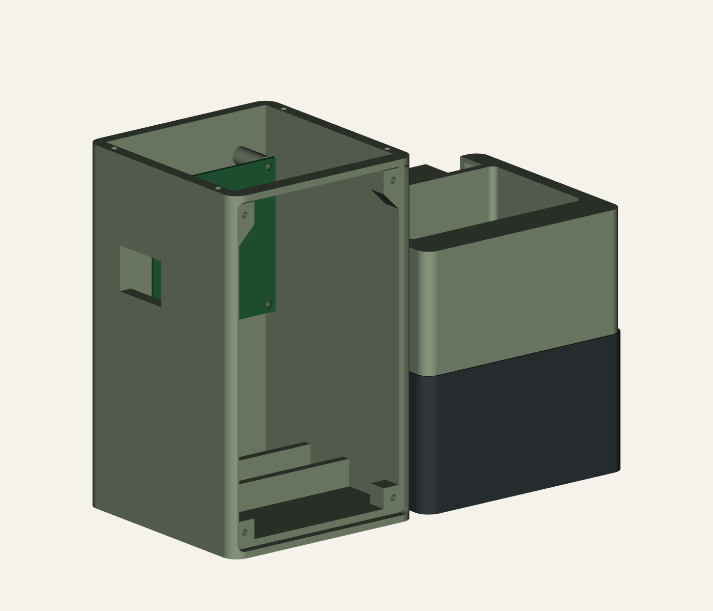
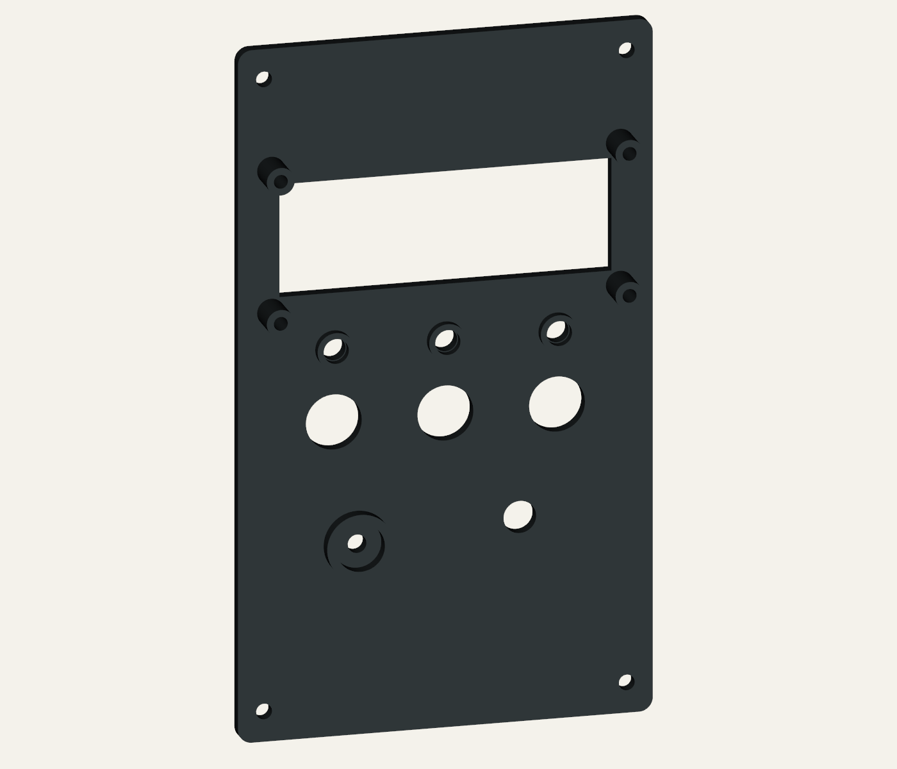
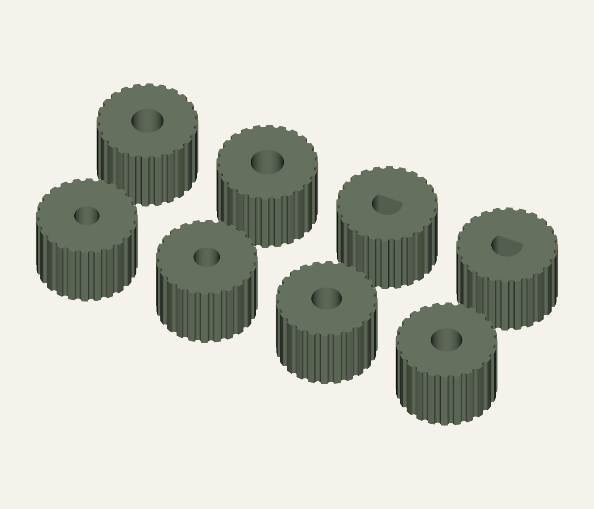
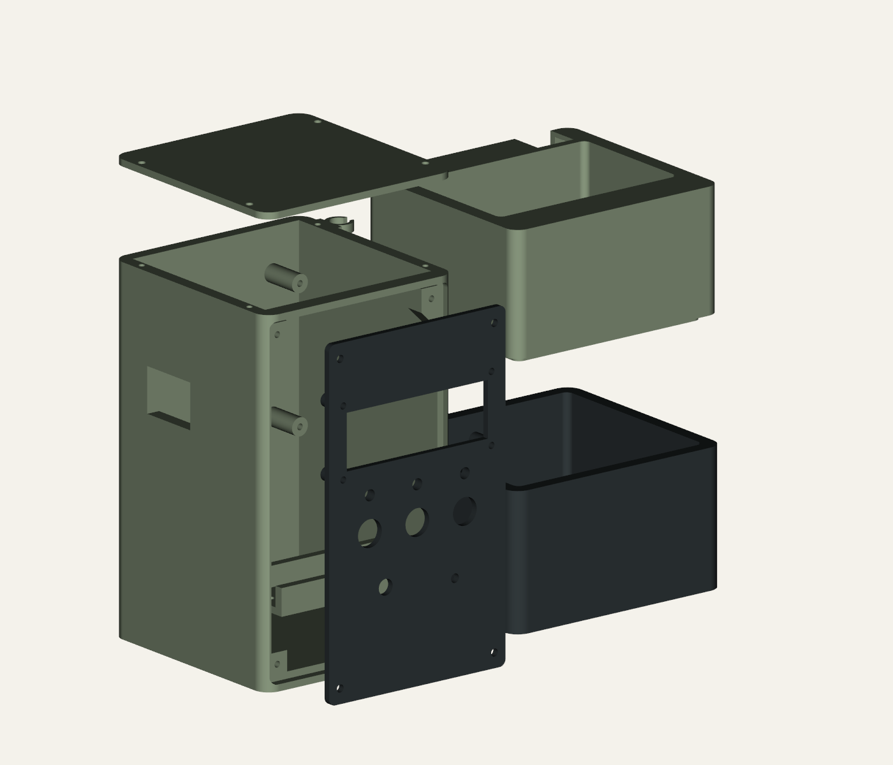

# Plant Station R8 - Manufacturing preparation and assembly

12 September 2026 | R8-A1 | mm

**Status: geometry verified; manufacturing release awaits measured fit and first article checks.**

## Plant Station / R8

Left USB access, supported fixings, glued indicators and shaft-fit knob options

R8 CAD exterior from the left. One illustrative knob is shown; choose its bore after trial fit.

<b>Changes:</b> carrier rotated 90 degrees anticlockwise as viewed from the LCD face; USB edge now faces left. Roof access hole closed. Upper fascia bosses have full side-wall webs with sloped undersides. Fascia has a 10.4 mm piezo glue seat and LED glue collars.

<b>Replace:</b> tower_sage, fascia_charcoal and top_cover_sage. Sump, planter, battery tray and hose clip retain the R7 design. Use one of eight knob variants. The package includes 22 printable files: seven enclosure parts, eight knobs, six fit coupons and one USB marking blank.

<b>Manufacturing status:</b> this is a controlled build-preparation pack, not a released production design. USB alignment, shaft fit, buzzer height, fastener retention, material and print settings require first article evidence. Print the coupons before large parts.

All illustrations are generated from R8 CAD. The internal green rectangle is a carrier outline reference, not a detailed electronics model. Historical concept art is not dimensional authority.

## 02 / Carrier and USB interface

Datum: x right, y rear, z up. Front is the LCD viewing face; left wall is x = 0.

R8 internal view with fascia and roof removed. Green rectangle shows the rotated PCB outline only.

| Feature | R8 nominal | Status / check |
| --- | --- | --- |
| Carrier outline | 64 x 67 installed | Source 67 x 64, rotated in its own plane |
| Hole centres | 57 horizontal x 60 vertical | (19.5,78.5), (76.5,78.5), (19.5,138.5), (76.5,138.5), in x,z |
| Seating plane | y = 76 | Components face towards fascia; assumed front stack 31.6 |
| USB window | 28 x 20 | Left wall: y = 49 to 77; z = 98.5 to 118.5. PROVISIONAL |
| Roof | 3 thick | Closed except four screw holes; no sealing claim |

<b>Before tower print:</b> mount the real board on the carrier coupon. Record each socket centre relative to the hole pattern, socket recession from the left wall, plug width/height and required insertion length. A small opening cannot be certified from the available drawings. Compare both plug envelopes with the window, then adjust USB_YZ and USB_WH in build.py and regenerate if needed.

The 34 x 26 x 1.2 USB marking blank overlaps this window by 3 mm per side. Tape it outside the wall for marking a custom opening; it is not a snap-fit insert or a seal. The provisional window may need moving or enlarging. Trial both actual cables with the fascia fitted, without forcing the sockets.

## 03 / Fascia, buzzer and indicators

Glue at component perimeters; leave sound outlet and LED lens faces clear.

Rear of R8 fascia: LCD standoffs, three LED collars and circular piezo seat.

| Feature | R8 nominal | Assembly instruction |
| --- | --- | --- |
| Piezo | 10 user OD; 10.4 seat ID | Seat centre x=67,z=45; 3 deep with 4 sound hole. Actual body height and sound port position unknown. |
| LEDs, quantity 3 | 5 front bore; 5.4 collar ID | Centres x=24/48/72,z=88. Collar extends 2 behind panel. Test lead clearance and actual LED flange. |
| Potentiometer | 7 panel bore | Centre x=32,z=48. Bushing thread, nut and antirotation feature unmeasured. |
| LCD | 71.4 x 24.6 aperture | 75 x 31 centres; 3 fixing bores; 8 stand-off. Use LCD coupon first. |

<b>Glue procedure:</b> dry-fit first, check polarity and test at the identified component rating. Clean the bonding surfaces. Apply a small compatible adhesive fillet around the piezo case perimeter and LED bodies from inside. Keep adhesive off diaphragms, sound ports, lens faces, contacts and serviceable screws. Cure fully to the adhesive instructions before closure.

A 10 mm diameter defines only the piezo envelope: active/passive type, height, voltage and current remain unknown. Glue the case, not an exposed vibrating disc. Insulate leads and add a harness service loop. If a bare disc is supplied, revise the mount for its supported rim before bonding.

## 04 / Knob selection

20 mm grip diameter x 14 high; 11 mm blind bore. Fit by hand without shaft loading.

Eight R8 knob variants, shown bore-up in print orientation. Groove on the closed face is the index mark.

| Coupon position | STL suffix | Bore geometry, mm |
| --- | --- | --- |
| Near row, left to right | round_5p0 / round_5p2 | Round 5.0 / 5.2 |
| Near row, positions 3 / 4 | round_6p0 / round_6p2 | Round 6.0 / 6.2 |
| Far row, positions 1 / 2 | round_6p35 / round_6p55 | Round 6.35 / 6.55 |
| Far row, positions 3 / 4 | D_6p0 / D_6p2 | D 6.0, flat offset 1.5; D 6.2, offset 1.6 from axis |

<b>Coupon orientation:</b> clipped corner nearest you on the left; four holes per row. Every knob filename starts knob_. Diameters are modelled bore sizes, not promises of fit. The D bores have overall circle-to-flat dimensions 4.5 and 4.7 respectively. Check both shaft diameter and flat depth.

<b>Selection:</b> print knob_fit_coupon, measure the shaft, then try the nearest bores by hand. Choose a sliding/friction fit that turns the pot without slipping or stressing its bearing. The 3 mm coupon checks diameter only; print the selected complete knob to verify 11 mm engagement. Splined shafts are not represented by a smooth-bore fit claim.

<b>Install:</b> secure the pot with its own panel washer/nut, set it to the desired reference stop, align the index groove, and push on gently. Leave at least 0.5 mm axial clearance to the fascia or nut. No grub screw is designed in; if friction retention fails, measure the shaft and revise the bore. Do not glue an unverified knob to the shaft.

## 05 / Fastener bill of materials

Nominal lengths are under the head. These are fit-trial selections, not released purchasing specifications.

| Qty | Provisional selection | Location and engagement constraint |
| --- | --- | --- |
| 4 | 3 x 8 plastic thread-forming pan head | Fascia: 3 panel + 5 pilot engagement; 2.8 pilots, 9 deep. |
| 4 | 3 x 8 plastic thread-forming pan head | Carrier: assumed 1.6 PCB + 6.4 engagement; 2.8 pilots, 11 deep. Verify PCB holes and underside insulation. |
| 4 | 3 x 8 plastic thread-forming pan head | Roof: 3 cover + 5 engagement; 7 deep pilots. Narrow wall: hand tighten. |
| 2 | 3 x 6 plastic thread-forming pan head | Battery tray: 3 tray + 3 engagement; 4 deep pilots. |
| 1 | 3 x 6 plastic thread-forming pan head | Hose clip: 4 clip + 2 engagement; only 3 deep pilot. Do not use 8 mm screw here. |
| 4 + 4 | M2.5 x 16 machine screws + M2.5 nuts | LCD: underhead plane y=1; printed stack to y=12, assumed PCB 1.6. Head OD <=5.5; verify nut access and thread projection. |
| 3 sets | Button supplied nuts/washers | 12 mm panel insert, 3 panel; provisional nut OD <=20, rear body <=35. |
| 1 set | Pot supplied nut/washer | 7 mm provisional panel bore; confirm actual bushing before purchase. |

<b>Buy/allocate for one build:</b> 12 of 3 x 8 plastic thread-forming screws, 3 of 3 x 6, 4 M2.5 x 16 screws and 4 M2.5 nuts, plus component-supplied hardware. Allow two spare screws of each type. No heat-set inserts or countersinks are modelled.

<b>Acceptance:</b> use the boss coupon and representative printed material to test the actual screw family. A 2.8 mm printed pilot is provisional and may be too loose for a particular 3 mm thread. Do not assume an ordinary M3 machine screw provides a validated plastic thread. Regenerate pilot sizes if retention is inadequate. Do not force an oversize screw into the 1.1 mm minimum roof pilot wall.

Tighten by hand until seated, then stop. No torque value is validated. Verify the PCB is not bowed, screws cannot contact live copper or the enclosure exterior, and all fixings survive removal/refitting without stripping. LCD length must be adjusted if the actual PCB or nut stack differs; keep any insulating washers in the measured stack.

## 06 / Electronics and consumables

Controlled inventory for one assembly; exact electrical part selections remain open.

| Qty | Item | Specification / open evidence |
| --- | --- | --- |
| 1 each | SunFounder carrier + ESP32 module | Carrier drawing reference only; identify board/module revision and pin reservations. |
| 1 | LCD with I2C backpack | 80 x 36 reference PCB, 75 x 31 holes; identify supply, pull-ups and backpack depth. |
| 1 | Capacitive moisture sensor | Identify output range; calibrate in the actual pot. |
| 1 | 5 V pump | Reference body 38.5 x 25.5 x 43; verify actual outlet, current and submersion. |
| 3 | Momentary panel buttons | 12 mm nominal; WATER, LAMP TEST, proposed STOP per current project record. |
| 3 + 3 | LEDs + individual series resistors | Nominal 5 mm bodies; determine polarity/current and resistor values from actual parts. |
| 1 | Linear potentiometer | Value, shaft, bushing and travel unknown; use 3.3 V ADC-compatible circuit. |
| 1 | 10 mm round piezo buzzer | User diameter; active/passive, height, rating and driver remain unknown. |
| 1 set | Pump driver and flyback protection | 3.3 V-compatible MOSFET drive, gate resistor/pull-down; size from actual motor. |
| As needed | I2C translator and sounder driver | Required where actual electrical levels/current require them. |
| 1 each | 18650 cell + insulated holder | Verify chemistry/protection/current and holder fit; printed tray is not bare-cell contacts. |
| 1 set | Power path, fuse, disconnect, wiring | Confirm charger/boost compatibility, USB isolation and pump startup capacity. |

Retain the existing firmware boundaries: manual timed dose only, pump disabled by default, no approved carrier pin map. Do not infer a safe wiring or charging scheme from the enclosure. See firmware/README.md and docs/ELECTRONICS.md.

## 07 / Printed parts and process

Suggested starting process only: record printer, nozzle, material, orientation and actual results.

| Qty | Printed part | Orientation / processing |
| --- | --- | --- |
| 1 | tower_sage | Trial base down; inspect horizontal carrier bosses, USB roof and front bosses for supports. Print upper_boss_print_coupon first. |
| 1 | fascia_charcoal | Front face flat on bed, rear bosses upwards; rotate assembly coordinates before slicing. |
| 1 | top_cover_sage | Flat on bed; solid cover has only fixing holes. |
| 1 each | sump_charcoal / planter_sage | Base down; inspect sump collars, planter lip and overhangs. Leak test separately. |
| 1 each | battery_tray / hose_clip | Flat lower faces on bed. Check hole/clip tolerances. |
| 1 | knob_* (selected bore) | Closed index face on bed, bore upwards; no bore supports. |
| 1 each | Six coupons | button, carrier, LCD, knob, piezo_LED and upper_boss coupons. |
| 0-1 | usb_marking_blank | Flat print; temporary tape attachment for marking only. |

<b>Starting trial:</b> 0.4 mm nozzle, 0.2 mm layers, four perimeters and five top/bottom layers; adapt to the chosen printer and material. These are proposed settings, not validated slice results. Pilot holes and thin collars need preview inspection. For a large tower print, inspect every layer where a boss first appears; use local supports where the actual slicer needs them.

<b>Consumables:</b> compatible electronics adhesive (small amount), insulating sleeves/heat-shrink, wire/terminals to measured current, cable ties and strain-relief anchors, external 8 mm OD tube to measured length, pump outlet adapter as needed, removable drain/inlet screens, and a compatible wet-side liner or coating if leak tests require it. Adhesive and coating quantities follow actual product coverage/cure instructions.

STLs are in mm and common assembly coordinates, except the knob/accessory coupons in local print coordinates. Move each individual STL to the bed. Never auto-scale. Dry tower envelope excluding separate lid is 104 x 100 x 158; ensure the selected bed, brim and supports fit. Material stiffness, temperature resistance and water compatibility are not qualified.

## 08 / Assembly route card

Record build ID, component revisions and any deviations at each hold point.

R8 exploded CAD. Offsets illustrate assembly order; fasteners and harness are listed separately.

<b>1. First article:</b> inspect coupons, verify PCB/LCD patterns, choose knob bore and trial fasteners. Measure USB sockets/cables and pot bushing before printing the tower/fascia. Release only the files that match those measurements.

<b>2. Prepare printed parts:</b> remove supports and burrs without enlarging controlled features inadvertently. Check bosses are fully fused to the tower side walls. Dry assemble the tower, fascia and roof; record screw retention and service access.

<b>3. Wet module:</b> fit the actual pump with a suitable retention method, route the tube and cable through the rear notch, and fit removable debris screens. Keep both 6 mm drains open. Leak-test over a tray with the electronics absent. Record maximum fill with drain-back headspace and minimum level required by the pump.

<b>4. Fascia:</b> mount LCD with four M2.5 screws/nuts, then buttons and potentiometer with their own hardware. Test LEDs/piezo at verified ratings, glue their case perimeters and cure. Fit the selected knob with clearance to the nut/panel.

<b>5. Dry tower:</b> secure carrier with USB edge left, fit insulated battery holder/tray, then insulated auxiliary boards and harness. Keep supplies disconnected while fitting. Provide service loops and strain relief; check both USB cables. Close fascia and solid roof, then join wet/dry modules on the dovetails. Support both modules when lifting.

## 09 / Inspection and commissioning

First article record. Blank results mean NOT VERIFIED, not acceptance.

Build ID: __________________  Date: ______________  Inspector: __________________ Printer/material: __________________  CAD hash: __________________ Carrier/LCD/pump/pot part numbers: ___________________________________________

| ID | Acceptance criterion | Result / evidence |
| --- | --- | --- |
| M01 | Carrier/LCD coupons match real hardware; no board strain | __________ |
| M02 | Both USB plugs fully engage with fascia/roof fitted; no wall/overmould clash | __________ |
| M03 | Upper bosses have continuous printed webs; pilots hold screws through service cycle | __________ |
| M04 | Selected knob turns without slipping, binding or axial load; mark matches desired stop | __________ |
| M05 | Piezo/LEDs retained after cure; clear outlets/lenses and insulated leads | __________ |
| M06 | Fastener lengths recorded; no exterior breakthrough, copper contact or stripped pilots | __________ |
| M07 | Wet module leak-free at chosen fill and drain-back; drains and hose clear | __________ |
| E01 | Actual pin allocation, supply rails, I2C levels and default-OFF driver verified | __________ |
| E02 | Pump disconnected: boot/reset/STOP/lamp test cause no unwanted pump command | __________ |
| E03 | Supervised wet test: startup voltage/current, temperature and dose/volume recorded | __________ |

Pump start/run current: __________ A   Minimum rail: __________ V Dose setting / measured volume: __________________________ Defects, concessions and release decision: ____________________________________ First article acceptance signature / date: _____________________________________

## 10 / Verification and configuration

R8 supersedes R7 tower, fascia and cover. Previous revisions remain archived.

| Evidence | Result | Limit |
| --- | --- | --- |
| CAD solids | 7 assembly solids valid | Single solid per enclosure part |
| Part interference | 21 pairs checked; no positive overlap | Does not model every wire, screw or actual component |
| Exported meshes | 22 pass | Closed, consistent winding, positive volume; 2 faces per edge; zero degenerate faces |
| STEP re-import | 22 valid single solids; 7-part assembly | STL extents agree within 0.03 mm; volume within 0.2 percent |
| Export sections | Rotated mounts, USB, LED/piezo, knob bores | Dimensions tested from exported STL; exact hardware fit unknown |
| Roof and boss webs | Solid-volume and feature probes pass | Not a load, slicing or print-strength test |
| Runtime | CadQuery import alone exits 1 after success | STL checker exits 0; local CadQuery shutdown issue persists |
| Physical tests | PENDING | No printer operation, slicing, leak test or powered commissioning performed |

<b>Configuration:</b> build.py is the editable R8 source. verification.json records assembly and feature checks; independent_mesh_check.json records reopened STL checks and hashes. knob_options.json defines bore variants. check_exports.py runs independently of the builder. R7 reference drawings are copied under references/ with their source register; source dimensions are unchanged.

<b>Retained authority:</b> carrier drawing centres 60 x 57 before rotation; primary LCD annotated image 75 x 31. The current project control file explicitly calls for three buttons and three LEDs. Earlier two-button notes and R6 carrier/LCD dimensions are historical. This revision changes no firmware or electrical pin mapping.

<b>Rebuild:</b> python mechanical/concept_rev8/build.py python mechanical/concept_rev8/check_exports.py python mechanical/concept_rev8/check_step.py python scripts/build_guide_r8.py python scripts/check_guide_r8.py python scripts/package_r8_illustrated.py

<b>Release gates:</b> close M01-M07 and E01-E03 with measured evidence. Any changed USB position, pilot diameter, shaft bore or component envelope requires regenerated exports and repeated affected checks. Source references: mechanical/concept_rev8/references/SOURCES.md; firmware/README.md; docs/PROJECT_CONTROL.md.
