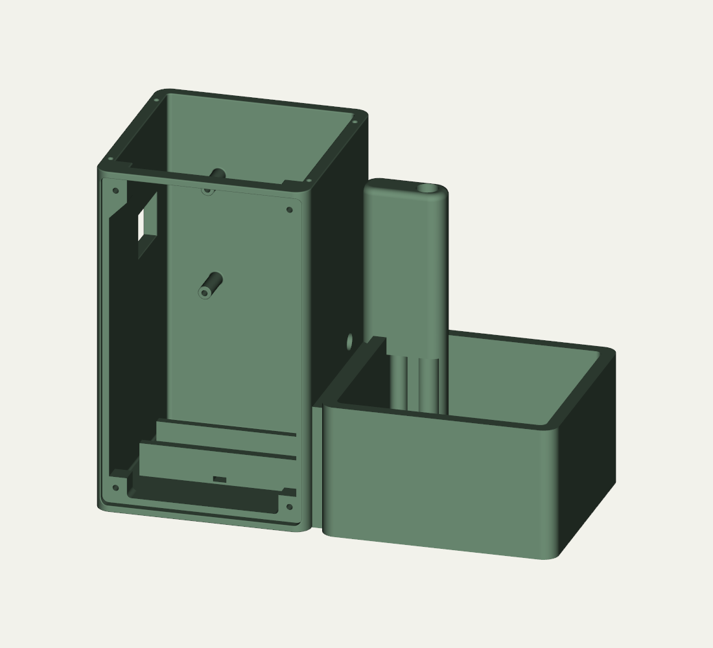
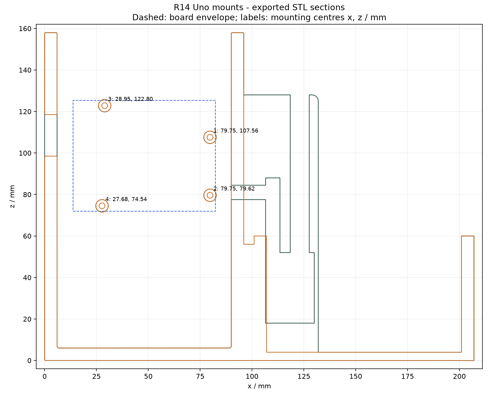
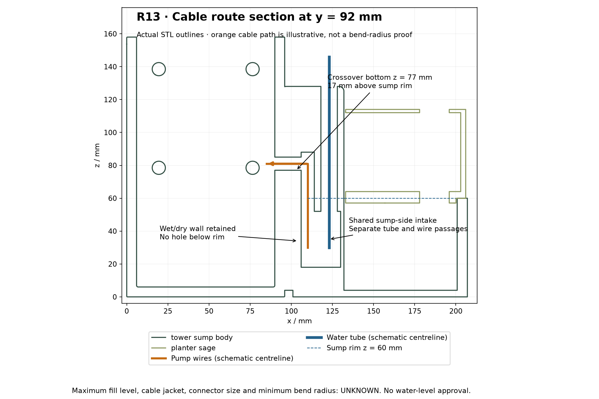
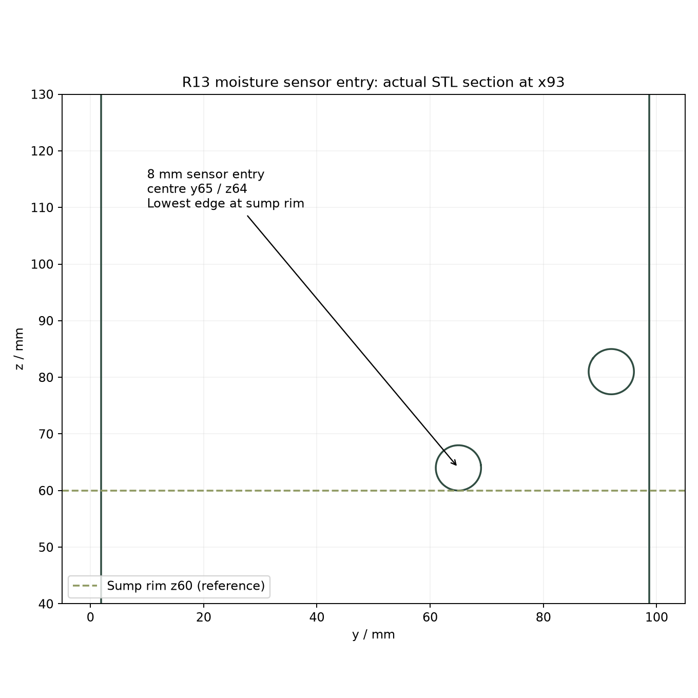

# R14 UNO | Assembly manual

PLANT STATION / PLANT-AM-R14-UNO / Issue A / 20 September 2026

Mechanical assembly, wiring and commissioning

A workshop manual for junior engineers assembling one Arduino Uno R3 plant station. Includes the complete mechanical sequence, component schedule, numbered harness drawings and test records.

<b>Build status:</b> mechanical prototype and motor-disabled bench electronics. This finished manual does not certify a finished watering appliance. Actual fit, pump power/driver selection and wet acceptance remain open.

Geometry: R14 tower with retained R13 fascia, roof and planter. Mechanical documentation baseline: R14-D2. Electrical reference: saved PlantUno bench v2 source.

<b>Files and updates:</b> <link href="https://github.com/skyhigh6/esp32-plant-station" color="#167d8d">https://github.com/skyhigh6/esp32-plant-station</link>

# 01 | Read first and obtain the files

Pages | Use
--- | ---
3-4 | BOM and incoming inspection
5-9 | Incoming inspection, fit trials and mechanical assembly
10-14 | Uno orientation, wiring diagrams and wire schedule
15 | Future pump circuit - design hold
16-17 | Firmware and dry commissioning
18-19 | Wet acceptance, care and build record
20 | Evidence, sources and revision control

Download the controlled configuration

Open the repository above, choose <b>Code &gt; Download ZIP</b>, extract it, and record the commit from the repository history. Do not print every STL in the repository; older revisions remain for traceability.

<link href="https://github.com/skyhigh6/esp32-plant-station/blob/main/mechanical/concept_rev14_uno/README.md" color="#167d8d">R14 tower, coupon and STEP files</link> <link href="https://github.com/skyhigh6/esp32-plant-station/blob/main/mechanical/concept_rev13/README.md" color="#167d8d">Retained R13 parts</link> <link href="https://github.com/skyhigh6/esp32-plant-station/blob/main/Plant_Station_R14_Uno_Review.zip" color="#167d8d">Complete mechanical review archive</link> <link href="https://github.com/skyhigh6/esp32-plant-station/blob/main/output/pdf/Plant_Station_R14_Uno_Assembly_Manual.pdf" color="#167d8d">This assembly manual</link> <link href="https://github.com/skyhigh6/esp32-plant-station/blob/main/docs/r14_uno_reference/PlantUno/PlantUno.ino" color="#167d8d">Bench firmware snapshot used by this manual</link>

<b>Excluded:</b> the purchased panel USB-C breakout is not fitted or wired. Adding it later requires a separate enclosure/print and electrical revision. The Uno's existing onboard USB socket remains the bench programming/power connection.

<b>Terms:</b> confirmed = supported by inspected files or test evidence; reported = user record; proposed = selected here but not physically qualified; unknown = inspect or measure before use. A drawing connection applies only after the component matches its stated type.

# 02 | BOM - printed parts and fasteners

ID / qty | Part / source | Specification and disposition
--- | --- | ---
M01 / 1 | R14 tower_sump_body_uno.stl | Integrated tower, sump and holder saddle; 207 x 100 x 158 mm.
M02 / 1 | R13 fascia_charcoal.stl | LCD, three nominal 12 mm buttons, 7 mm pot bore.
M03 / 1 | R13 top_cover_sage.stl | Retained roof; assembled height approximately 161 mm.
M04 / 1 | R13 planter_sage.stl | Retained planter, two drains and service reliefs.
M05 / 1 | R13 selected knob STL | Choose round or D shaft after measurement; print one variant.
T01 / 1 | R14 uno_mount_fit_coupon.stl | Mandatory board registration and pilot trial.
T02 / as needed | R13 fit coupons | LCD, button, knob, piezo/LED and upper boss coupons. Do not use carrier coupon for Uno.
F01 / 4 | Uno screws | M3 candidate; length/head/thread process selected by trial. Pilot 2.8 mm x 11 mm deep.
F02 / 8 | Fascia + roof screws | 4 each; 3 x 8 mm plastic thread-forming is provisional. Verify actual engagement.
F03 / 4 sets | LCD screws and nuts | M2.5 x 16 mm provisional; head <=5.5 mm. Verify stack and thread projection.
F04 / 4 sets | Component nuts/washers | Three buttons and one potentiometer; supplied matching hardware.
F05 / 1 | Holder cable tie, optional | 4.8 x 1.5 mm provisional; tunnel 6 x 2.5 mm. No cell fitted.

<b>Purchased hardware evidence:</b> Photo 2 shows an M2/M2.5/M3 button-head screw, Nyloc nut and washer listing, plus a 2.2-6.0 mm plastic self-tapping screw listing. The selected sizes, lengths and quantities are not visible. Sort and measure the delivered parts; listing ranges are not fit specifications.

Machine screws and plastic thread-forming screws are different systems. Do not force an M3 machine screw into an unqualified printed pilot. A Nyloc nut is not used behind a blind tower boss. No separate battery-tray or hose-clip screws are required.

# 03 | BOM - electronics and consumables

ID / qty | Component | Build requirement / evidence
--- | --- | ---
U1 / 1 | Arduino Uno R3 | Classic 5 V ATmega328P; actual clone/board markings to record. Not Uno R4.
DS1 / 1 | 16 x 2 I2C LCD | Existing QAPASS/PCF8574 assumed; verify labels and 5 V rating. Saved v2 LCD test passed.
SEN1 / 1 | Capacitive soil probe | Existing v1.2 reported; verify 3.3 V operation and pin order.
RV1 / 1 | Linear potentiometer | 10 kOhm proposed if purchasing; verify actual resistance, shaft and terminals.
SW1-3 / 3 | Illuminated panel switches | Photos show red, green and yellow ring listings. Diameter, momentary/latching option and ring voltage unknown.
LED1-3 / 3 | Low-current indicator LEDs | Reference circuit: red lockout, blue dose, green ready. Separate LEDs unless ring ratings are verified.
R1-3 / 3 | 1 kOhm resistors | One per bare LED; 0.25 W adequate for this circuit.
PS1 / 1 | Uno USB data/power lead | Match actual onboard socket. Dry bench supply only; no external 5 V injection.
P1 / 1 | DC pump | 3.3 V reported; actual label, current, outlet and envelope to verify. Leave disconnected.
DRV1 / 1 set | Pump driver and supply | Not selected; MOSFET, diode, gate resistors, fused regulated supply and disconnect required. See p15.
BZ1 / 1 | 10 mm case sounder | Type/current/height unconfirmed; no connection in this issue.
BAT1 / optional | 18650 holder/power system | Mechanical provision only. Cell, charger/protection and power path not released.
C01 / as needed | Harness and wet-side items | Insulated wire, labels, connectors, heatshrink, edge protection, strain relief, measured tubing, drain screens; compatible sealing material if needed.

Use approximately 0.2-0.35 mm2 flexible insulated wire for short low-current bench signal runs. Motor wire, supply rating and fuse depend on measured current. Label both ends of every wire; colours alone are insufficient.

Bought does not mean electrically identified. Do not connect the unknown illuminated rings, sounder, cell or motor to an Uno pin. The USB-C panel module is deliberately omitted from this BOM.

# 04 | Incoming inspection and tools

Tools and preparation

Use callipers, a multimeter with continuity and DC-voltage ranges, hand screwdrivers, small spanners, cutters, wire stripper, suitable crimp/solder tools and heatshrink. Keep the bench dry. Disconnect USB and all supplies before handling wiring. Use a current-limited supply for future motor characterisation.

Check | Method | Pass / action
--- | --- | ---
Switch action | Meter on unpowered contact pair; operate and release. | Normally open at rest; closed only while pressed. Latching switches do not meet the current interface.
Switch contacts vs ring | Use supplier terminal drawing and meter; identify COM/NO/NC and LED +/-. | Record labels. Use COM/NO only; insulate NC. Do not identify lamp wires by colour alone.
Ring rating | Read selected order details, markings or matching supplier data. | Record voltage, current, polarity and any internal resistor. Leave isolated until known.
Panel fit | Measure barrel, nut, rear projection and pot bushing. | Trial coupon and fascia without forcing; nominal button bore 12 mm.
Fasteners | Measure diameter/under-head length; identify thread family. | Trial on coupon. Record engagement and positive bottoming clearance.
LCD and probe | Read module labels, supply ratings and connector order. | Follow labels, not the apparent order in a generic diagram.
Board and cables | Record board revision; inspect underside and plug envelope. | All four Uno holes register; USB insertion and service access verified.

Hold point HP1: do not print the complete tower until the Uno coupon and screw-fit trials pass. Do not energise any unidentified module. Record failures rather than modifying parts until they appear to fit.

# 05 | Fit and mount the Arduino Uno

<b>1.</b> Print the Uno coupon at 100% scale in the intended process. Offer it to the PCB underside with its screw-test boss facing away. All four 3.2 mm gauge holes must register without board bending.

<b>2.</b> Trial screw/thread preparation in the 2.8 mm coupon pilot. Its boss is 8 mm high: use a short trial screw. It does not reproduce the tower's 11 mm blind depth.

<b>3.</b> Inspect the full tower print: roots sound, support removed, pilots clear, seating faces coplanar and wet/dry divider undamaged. Record printer, material, scale, orientation, layer height and supports.

<b>4.</b> Insert the Uno through the front with fascia and roof removed. Components face the fascia; USB faces left. PCB underside seats at y76; rear wall y94 gives 18 mm nominal rear clearance.

<b>5.</b> Fit four qualified screws. Engagement = under-head length minus measured PCB/washer stack. Keep engagement below 11 mm with positive bottoming margin. Hand-tighten; no torque is qualified. Check all supports contact without bowing.

HP2: check screw heads, solder joints, headers, USB/power plugs and cable removal with the fascia in place. The retained side aperture was designed for the earlier carrier; direct Uno USB access is not established by the mount geometry.

# 06 | Assemble the wet-side routes

<b>6.</b> Inspect sump floor and walls for cracks/pinholes. Remove print debris and clear both planter drains. Trial the pump, leaving it electrically disconnected. The CAD reference envelope is 38.5 x 25.5 x 43 mm; it is not the measured 3.3 V pump.

<b>7.</b> Feed the water tube through the 10 mm bore at x123/y92. Keep the tube outside the electronics cavity. Actual tube OD, connector size, bend radius and outlet retention must be checked; the old separate hose clip is not used.

<b>8.</b> Route the two isolated pump leads through the separate 8 mm bore at x110/y92 and the crossover into the tower. Keep leads free from abrasion and moving/removed parts. Insulate both ends pending driver selection.

<b>9.</b> Trial the planter through its full insertion/removal travel. Fit removable debris guards without blocking the two drains. Provide enough slack to service the pump and planter without pulling connections.

No water during electrical assembly. The sump rim at z60 is not a fill mark. Printed passages are not sealed glands; no maximum fill volume has been qualified.

# 07 | Sensor route and fascia components

<b>10.</b> Route the probe lead through the sensor entry and matching planter relief. Add suitable edge protection and strain relief. Leave a service loop; keep the probe electronics above the wetting/soil limit for the actual sensor.

<b>11.</b> Mount the LCD on the fascia rear: reference centres 75 x 31 mm, aperture 71.4 x 24.6 mm. Trial four M2.5 screws/nuts; avoid board bow and conductor contact. Verify backpack depth and access to the contrast trimmer.

<b>12.</b> Fit the identified momentary buttons and potentiometer using supplied nuts/washers. Match actual parts to the 12 mm and 7 mm nominal bores. Fit the selected knob with at least 0.5 mm axial clearance.

<b>13.</b> For the existing firmware, label WATER and LAMP TEST. The third switch is SPARE / NOT ACTIVE; do not label it STOP while USE_STOP=false. Switch colour does not establish its function.

<b>14.</b> Fit separate reference LEDs or retain ring wires insulated pending identification. Red=lockout, blue=dose request and green=ready are the software meanings. Yellow purchased ring is not an automatic electrical substitute for blue.

Keep the unidentified sounder disconnected. If fitting an empty insulated holder, route a tie through the 6 x 2.5 mm saddle tunnel before installing it; leave the cell out. Battery operation is outside this issue.

# 08 | Harness installation and closure

<b>15.</b> Build the harness on the bench using pages 10-14. Number both ends W01 onward and label components U1, DS1, SEN1, RV1 and SW1/SW2. Use insulated distribution terminals for shared 5 V, 3.3 V and ground; do not stuff multiple bare ends into an Uno socket.

<b>16.</b> Verify each wire against the schedule with power off. Confirm no crossed supply rails, no uninsulated joints, correct LED polarity/resistors and correct COM/NO switch contacts. Tug-test terminations gently.

<b>17.</b> Complete dry bench commissioning with the assembly open. Then disconnect power, arrange service loops and retain the harness away from screw tips, wet openings and sharp edges.

<b>18.</b> Offer up the fascia and fit four qualified screws. Refit the roof with four screws. Hand-tighten only. Ensure cables cannot be pinched between mating faces.

<b>19.</b> Fit and remove the planter again. Check both drains, tube bend, sensor lead, pump leads, USB access and cover seating. Photograph the internal routing before final closure.

HP3: all dry mechanical and electrical checks must pass before closing the assembly. Power remains USB bench power; no motor, external supply, battery or panel USB-C connection is included.

# 09 | Uno R3 orientation and terminal map

See vector wiring drawing in PDF: board

Simplified top view with the onboard USB socket at the left. Header order is shown for orientation; spacing and board outline are schematic. Verify the printed pin labels on the actual Uno/clone before connecting.

Terminal | Connection
--- | ---
5V / GND | LCD and pot supply / common return
3.3V / A0 / A1 | Probe supply / probe output / pot wiper
A4 / A5 | LCD SDA / SCL; not digital D4 / D5
D2 / D3 | WATER / LAMP TEST normally-open contacts
D5 / D6 / D7 | Red / blue / green reference LED via individual 1 kOhm resistor
D4 / D8 / D9 | Unused STOP / sounder reserve / motor reserve; leave disconnected

The dedicated SDA/SCL header duplicates A4/A5; use one connection set. D0/D1 remain free for USB serial. Use the Uno's onboard USB connector for this bench configuration. See official pinout source S1 on p20.

# 10 | Wiring drawing E01 - LCD and analogue

See vector wiring drawing in PDF: analogue

Read the drawing

Each horizontal line is one physical wire. Wire ID is the primary identifier; colour is secondary. Separate GND wires join at a common insulated ground distribution point connected to Uno GND. Component terminal positions are functional, not a claim about connector order.

<b>LCD:</b> VCC=5 V, GND=ground, SDA=A4, SCL=A5. Check the backpack labels. Adjust contrast only after successful I2C initialisation. No ESP32 level shifter is used in this 5 V Uno/5 V backpack arrangement.

<b>Probe:</b> verify the actual module works at 3.3 V. VCC=3.3 V, GND=ground, AOUT=A0. Keep its output within the Uno input range and never connect an unknown 5 V output to the 3.3 V supply terminal.

<b>Pot:</b> outer terminals to 5 V/GND, wiper to A1. Identify the wiper with a meter. Swap only the two outer leads if clockwise decreases the setting. This prototype has no validated open-wiper fail-low circuit.

Orange is 3.3 V; red is 5 V. Never bridge these rails. The probe is the only proposed 3.3 V load; measure its current and check the actual board capacity before energising.

# 11 | Wiring drawing E02 - controls and LEDs

See vector wiring drawing in PDF: controls

<b>Switch detail:</b> W11 goes to SW1 COM and W12 returns SW1 NO to GND; W13/W14 do the same for SW2. COM and NO may be interchanged electrically. A four/five-terminal illuminated switch has a separate lamp circuit: do not bridge it to the contact pair.

<b>LED detail:</b> D5/D6/D7 each feeds its own 1 kOhm resistor, then the LED anode (+). Each cathode (-) returns to GND. The resistor may physically sit at either end of its series branch; never omit it for a bare LED.

At 5 V, 1 kOhm limits each bare-LED branch to less than 5 mA, even before LED forward voltage is considered. This is a low-current indication circuit; brightness is not yet qualified.

<b>Purchased rings:</b> keep isolated until their rated voltage/current and internal resistor are known. A 12 V ring is not powered from 5 V, and an unknown ring is not driven directly by GPIO. If the rings need a driver, issue a revised drawing. The red/green/yellow purchases do not establish the red/blue/green reference LED circuit.

SW3 and its lamp remain spare. LAMP TEST cancels the simulated dose; a three-press gesture also enters diagnostics. There is no active dedicated STOP button in the supplied bench snapshot.

# 12 | Wire schedule - power and analogue

Wire / colour | From | To | Check
--- | --- | --- | ---
W01 / red | U1 5V via +5V terminal | DS1 VCC | 5 V-rated LCD only
W02 / black | Ground terminal | DS1 GND | Common ground
W03 / blue | U1 A4 | DS1 SDA | Not D4
W04 / yellow | U1 A5 | DS1 SCL | Not D5
W05 / orange | U1 3.3V | SEN1 VCC | Module rating verified
W06 / black | Ground terminal | SEN1 GND | Verify module label
W07 / green | SEN1 AOUT | U1 A0 | Analogue output
W08 / red | +5V terminal | RV1 high outer | Check direction
W09 / black | Ground terminal | RV1 low outer | Check direction
W10 / violet | RV1 wiper | U1 A1 | Variable 0-5 V
W21 / red | U1 5V | +5V distribution terminal | Feeds W01 and W08
W22 / black | U1 GND | Ground distribution terminal | Feeds all return wires

Harness conventions

E01/E02 show logical nets. W21 and W22 are the physical feeder wires to the shared distribution terminals. Each branch has its own numbered conductor. Do not put a component in series with another component's ground return.

Fit a removable connector where servicing requires it, with matching labels on both halves. Record connector pin order in the build record; no connector family or cavity assignment is implied here. Keep sensor signal and I2C runs short and separated from future motor-current wiring.

Before USB connection, disconnect unknown modules and check for wiring shorts with the meter. Electronic circuits can show changing resistance while capacitors charge; investigate a persistent near-zero supply-to-ground reading. Do not use resistance/continuity mode on a powered circuit.

# 13 | Wire schedule - controls and indicators

Wire / colour | From | To | Function
--- | --- | --- | ---
W11 / white | U1 D2 | SW1 COM | WATER input
W12 / black | SW1 NO | Ground terminal | WATER return
W13 / grey | U1 D3 | SW2 COM | LAMP input
W14 / black | SW2 NO | Ground terminal | LAMP return
W15 / red | U1 D5 | R1 1 kOhm -> LED1 anode | Red lockout
W16 / black | LED1 cathode | Ground terminal | LED1 return
W17 / blue | U1 D6 | R2 1 kOhm -> LED2 anode | Blue dose request
W18 / black | LED2 cathode | Ground terminal | LED2 return
W19 / green | U1 D7 | R3 1 kOhm -> LED3 anode | Green ready
W20 / black | LED3 cathode | Ground terminal | LED3 return

Each W15/W17/W19 identifier covers its wired series branch to the resistor. Mount the resistor adjacent to the LED and sleeve the resistor-to-anode joint; label the branch ends. Each LED return remains separately numbered.

Reserved terminal | Issue A disposition
--- | ---
D4 | No wire; USE_STOP=false. SW3 is spare, not a safety stop.
D8 | No wire; unidentified sounder left disconnected.
D9 | No wire in the bench harness; MOTOR_ENABLED=false keeps output LOW.
VIN / barrel / external 5V | No external supply connection in this build.
Panel USB-C / cell | Excluded. No connection to any supply rail.

White/grey wire must still carry its W-number because colour discrimination is not an acceptance method. Supplier lead colours do not override the verified terminal identity. Keep spare leads individually insulated.

# 14 | Future pump driver - design hold

See vector wiring drawing in PDF: pump

E03 is a complete circuit concept, not an instruction to energise the present pump. The pump is reported as 3.3 V, but its actual identity, startup/stall current and duty limits are unknown. Select parts only after those measurements and matching datasheets are available.

Future ID | Connection / selection criterion
--- | ---
W30 brown | D9 -> 100-220 Ohm gate resistor -> Q1 gate.
W31 black | Uno GND -> motor supply GND / Q1 source; shared reference.
W32 red | Regulated 3.3 V supply + -> fuse/disconnect -> motor +.
W33 black | Motor - -> Q1 drain. Motor return must not flow through an Uno header.
Q1 / RPD | Logic-level N-MOSFET specified at 4.5/5 V gate drive, adequate current/thermal rating; 47-100 kOhm gate-to-source pull-down.
D1 | Flyback diode: cathode/band to motor +, anode to drain; rated for actual current and supply.

Do not power the motor from Uno 3.3V, 5V or GPIO. Keep MOTOR_ENABLED=false until the driver, regulated supply, fuse, disconnect, default-OFF behaviour and flow tests have passed. USB-powered Uno and the separate motor supply share GND only; do not join positive rails.

An independent power disconnect is required. Software timeout cannot stop a shorted MOSFET or guarantee recovery from a processor hang. Battery/charging design remains a separate configuration decision.

# 15 | Firmware installation and operation

The manual carries a frozen copy of the existing local bench v2 source in <b>docs/r14_uno_reference/PlantUno/</b>. It includes PlantUno.ino, PlantController.h and PlantView.h. No firmware behaviour was changed for this manual; source SHA-256 values are recorded in the adjacent evidence manifest.

<b>20.</b> Keep all three files in the PlantUno folder. Install Arduino IDE/CLI and the Arduino AVR Boards package. Select Arduino Uno / ATmega328P and the detected port, not Uno R4. Install <b>hd44780 by Bill Perry</b> using Library Manager; it is not bundled here.

<b>21.</b> With only the identified dry bench harness connected, compile and upload through the onboard USB socket. Disconnect the motor and all future supplies. Open serial at 115200 baud. Expect PlantUno bench v2 and LCD initialisation status=0.

arduino-cli compile --fqbn arduino:avr:uno   docs/r14_uno_reference/PlantUno CLI command shown wrapped; enter it as one line. Choose the actual port explicitly for upload.

Control / indication | Bench v2 behaviour
--- | ---
WATER | One simulated 0-5000 ms dose per press; knob sampled at start. Releasing WATER does not cancel. No automatic watering.
LAMP TEST | Cancels dose and illuminates reference LEDs. Release required before re-arm.
Triple LAMP | Three debounced presses within 1.2 s toggle VIEW; repeat to leave. WATER inhibited in VIEW.
VIEW display | Probe raw/relative moisture, pot raw/percent and WATER/LAMP states.
Normal display | Relative moisture, Ready MOTOR OFF, TEST dose, LAMP TEST or release instruction.
Moisture calibration | Dry=447, settled wet=221; clamped relative index. Not volumetric water content. Recalibrate for changed soil/probe.

Default: USE_STOP=false; MOTOR_ENABLED=false. Do not enable the motor simply by changing the constant. Historical v1 LCD fault evidence is superseded only for the saved v2 bench run, not for your newly assembled unit.

# 16 | Dry commissioning - record every result

Test | Method | Acceptance
--- | --- | ---
E01 | Power off; inspect every wire against schedule. | No crossed rails; all joints insulated; unknown modules isolated.
E02 | Uno + LCD first; power via onboard USB. | Stable supply; serial starts normally; LCD status=0 and steady readable text.
E03 | Remove power; add probe. Repower and observe VIEW. | Raw reading changes plausibly with probe condition. Record dry/wet values; protect electronics from water.
E04 | Remove power; add pot. Repower; sweep fully. | Raw approximately 0-1023, monotonic; clockwise increases. Record actual endpoints.
E05 | Add switches/LEDs with power off, then test. | Released WATER/LAMP=0; pressed=1. Lamp test lights all three reference indicators.
E06 | Set pot midrange, press WATER, keep held. | Single simulated dose; no repeat while held. Release/repress required.
E07 | Start simulated dose, then press LAMP. | Request cancels; release lockout clears after stable release.
E08 | Triple LAMP; attempt WATER; exit VIEW. | VIEW toggles; no dose in VIEW; release required on exit.
E09 | Measure D9 to GND during boot, WATER and LAMP. | LOW throughout normal bench tests; no motor connected.
E10 | Close after disconnecting; check routing and access. | No pinch/strain; all covers seat; planter removable; USB accessible.

Fault isolation

<b>LCD fault:</b> power off, verify GND/5V/A4/A5 and backpack labels. A contrast adjustment cannot repair an I2C bus fault. For resets/flashing backlight, inspect supply and watch for repeated startup messages. <b>Input always pressed:</b> check COM/NO and latching variant. <b>LED dark:</b> check polarity, resistor and correct pin. <b>Pot/probe erratic:</b> check ground, wiper/output contact and connector identity.

HP4: save the serial log, measured rail values, wire check and photographs. Any failure stays open until corrected and retested. Prior bench evidence does not accept the installed harness.

# 17 | Wet acceptance, operation and care

Proceed only after the pump design hold is closed

<b>22.</b> Establish the actual pump rating, driver/supply/fuse selection, electrical isolation/strain relief, default-OFF tests and a controlled test procedure. Reassess switch functions and a clear stop/disconnect method before enabling delivery.

<b>23.</b> Leak-test the wet assembly with electronics removed or positively isolated. Use a catch tray and inspect all seams, riser routes and sensor entry. No fill volume is prescribed: determine and record a limit below unsealed entries, allowing for drain-back, splash and handling.

<b>24.</b> Check both drains and pump inlet remain clear with the chosen soil/guards. Verify that stopped flow does not siphon water into the planter or electronics. Correct the outlet arrangement if siphoning occurs.

<b>25.</b> Under supervision, calibrate volume versus run time at the installed lift and tube route using a measured vessel. Record repeatability and the selected maximum dose. Do not label the knob in millilitres from elapsed time alone.

<b>26.</b> Record wet-test results and reviewer disposition. Until complete, operate only in motor-disabled dry bench mode. No unattended-operation claim is made.

Routine use after acceptance

Check water level, intake, tube security and dry electronics before each supervised use. There is no reservoir-level interlock; prevent dry running by inspection and the pump's rated limits. Moisture indication is advisory. Repeated WATER presses can overwater.

Cleaning and service

Disconnect all power before lifting the planter or touching wiring/pump. Empty before moving; support the entire base. Clear both drains and intake screens. Clean only with materials and temperatures compatible with the actual print/coating. Never immerse the electronics tower.

Leakage, unexpected pump running, hot wiring or repeated resets: disconnect power, contain/empty water, record the defect and investigate. A software stop is not electrical isolation.

# 18 | Build and acceptance record

Complete for each physical assembly. Attach photographs, serial logs, measurements and any non-conformance record. A blank entry is not a pass.

Record | Value / evidence reference
--- | ---
Build ID / date / engineer | ________________________________________________
Git commit / manual issue | ________________________________________________
Printer / material / slicer / job | ________________________________________________
Board / LCD / probe variants | ________________________________________________
Switch size / action / lamp rating | ________________________________________________
Fasteners / thread process | ________________________________________________
Coupon / screw-fit evidence | ________________________________________________
PCB engagement / bottoming margin | ________________________________________________
USB / component minimum gaps | ________________________________________________
Harness / connector revision | ________________________________________________
Measured 5 V / 3.3 V rails | ________________________________________________
Dry tests E01-E10 / evidence | ________________________________________________
Firmware source hash / upload log | ________________________________________________
Pump / driver / supply / fuse | ________________________________________________
Leak / fill / siphon / flow evidence | ________________________________________________
Open defects / restrictions | ________________________________________________
Disposition / reviewer / date | ________________________________________________

<b>Current disposition at issue:</b> geometry digitally checked; actual fit and installed tests open. Pump, sounder, battery and illuminated-ring integration not electrically released. Panel USB-C excluded.

Any geometry or electrical change needs updated drawings, source identity and relevant repeated tests. Retain the original record; add a dated correction with the reason and affected part/wire/test IDs.

# 19 | Evidence, sources and revision control

Ref | Basis / limit
--- | ---
E1 | R14 verification.json and independent_mesh_check.json: digital CAD/STEP and mesh evidence; no physical qualification. Independent mesh check rerun 20 Sep 2026, PASS.
E2 | R13 retained geometry and kit drawings: tube/wire routes, fascia, planter and holder saddle. Carrier mounting instructions superseded by R14.
E3 | PlantUno bench v2 source and 15 Sep 2026 serial log: LCD status=0, lcd=OK, motor=OFF over saved five-second readback. Does not prove full commissioning.
E4 | User purchase screenshots supplied 20 Sep 2026: red/green/yellow ring-switch listings, mixed machine hardware and plastic screw listings. Selected variants not visible. Screenshots not reproduced or published.
S1 | Arduino Uno R3 official pinout and board documentation, checked 20 Sep 2026. Used to cross-check labels, 5 V logic and duplicate SDA/SCL.
S2 | Bill Perry / duinoWitchery hd44780 library documentation, checked 20 Sep 2026. Install separately; library licence GPL-3.0.

<link href="https://docs.arduino.cc/resources/pinouts/A000066-full-pinout.pdf" color="#167d8d">S1: Official Arduino Uno R3 full pinout</link> <link href="https://docs.arduino.cc/hardware/uno-rev3/" color="#167d8d">S1: Arduino Uno R3 board documentation</link> <link href="https://github.com/duinoWitchery/hd44780" color="#167d8d">S2: hd44780 library source and documentation</link>

<link href="https://github.com/skyhigh6/esp32-plant-station/blob/main/mechanical/concept_rev14_uno/ACCEPTANCE.md" color="#167d8d">R14 acceptance register</link> <link href="https://github.com/skyhigh6/esp32-plant-station/blob/main/docs/r14_uno_reference/evidence_manifest.json" color="#167d8d">Source snapshot and evidence hashes</link>

Issue history

<b>Issue A, 20 September 2026:</b> complete Uno assembly manual; R14/R13 configuration consolidated, wire colours/numbers assigned, purchased-part inspection added, bench v2 evidence reconciled. Original functional wiring diagrams created for this manual; diagrams are not photographs or exact component pin-layout drawings.

The manual is complete for the documented configuration. Open engineering decisions are explicit because no defensible voltage rating, purchased variant, pump current, physical fit or wet acceptance can be inferred from a listing image or a CAD pass.