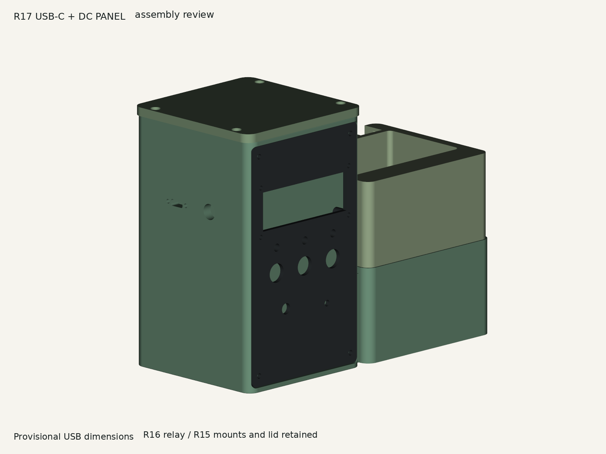
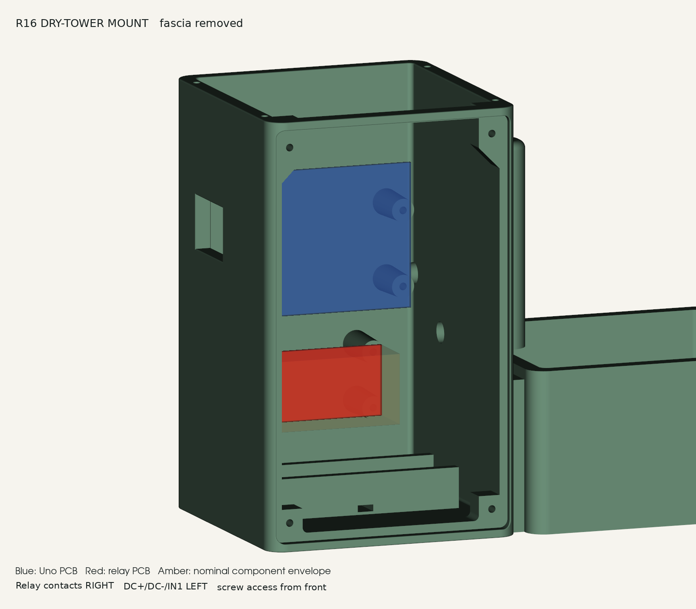
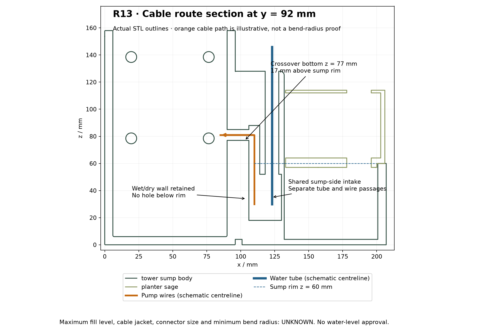
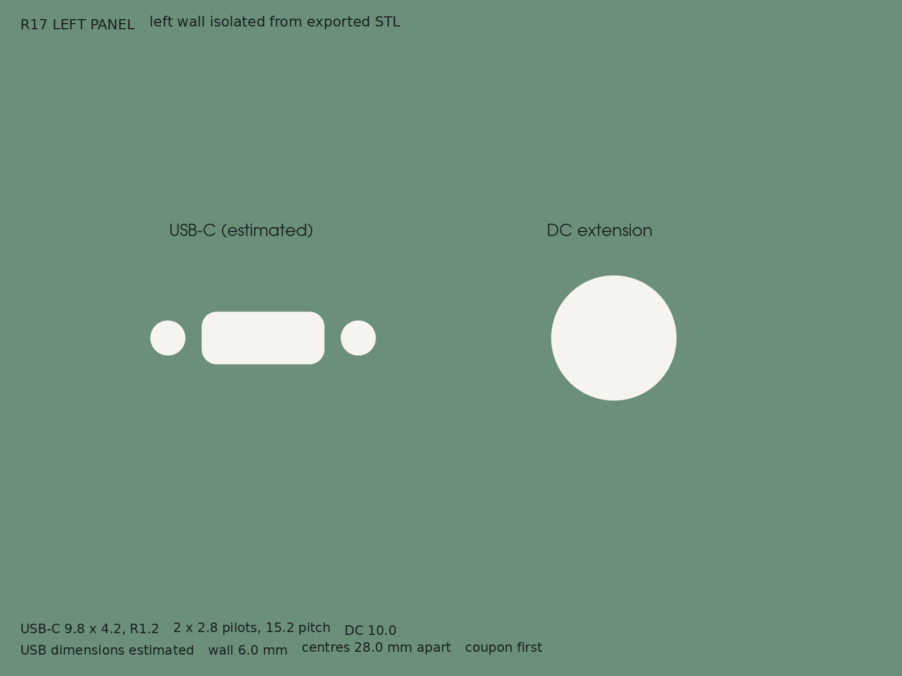
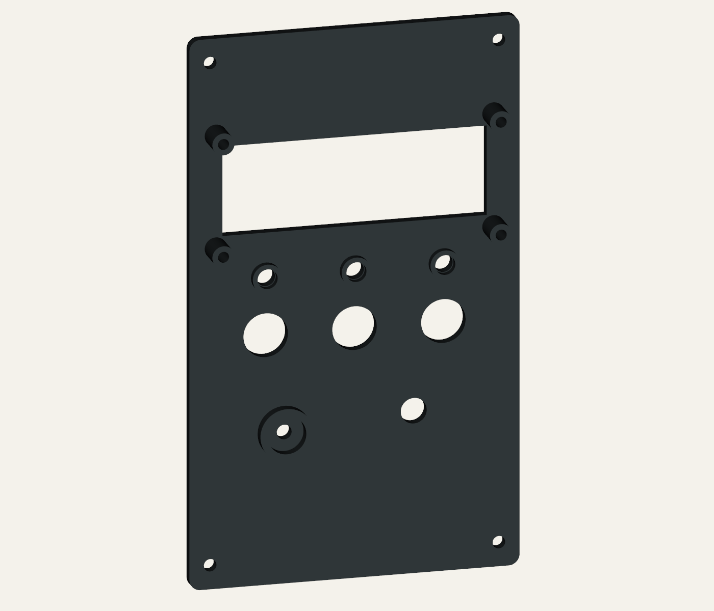
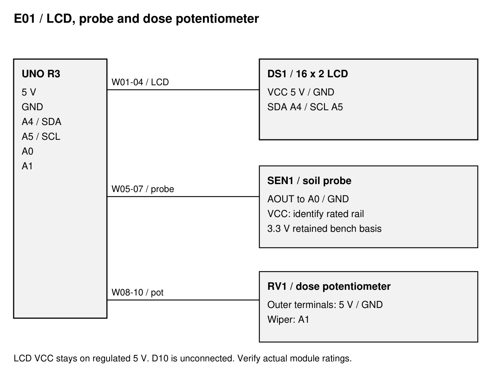
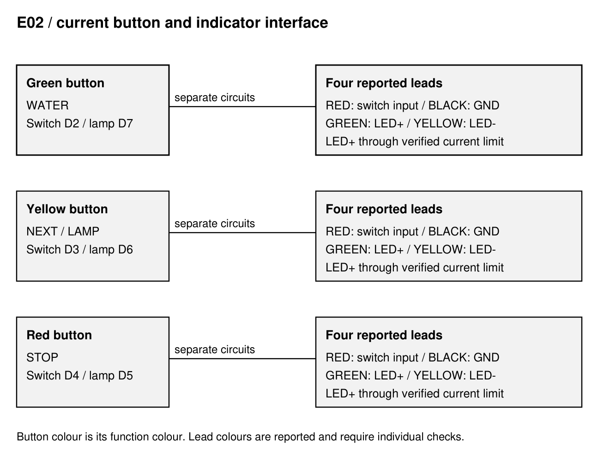
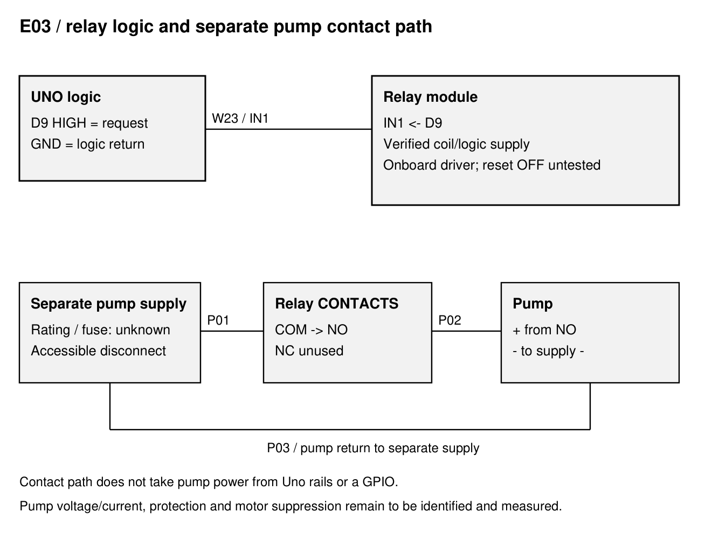
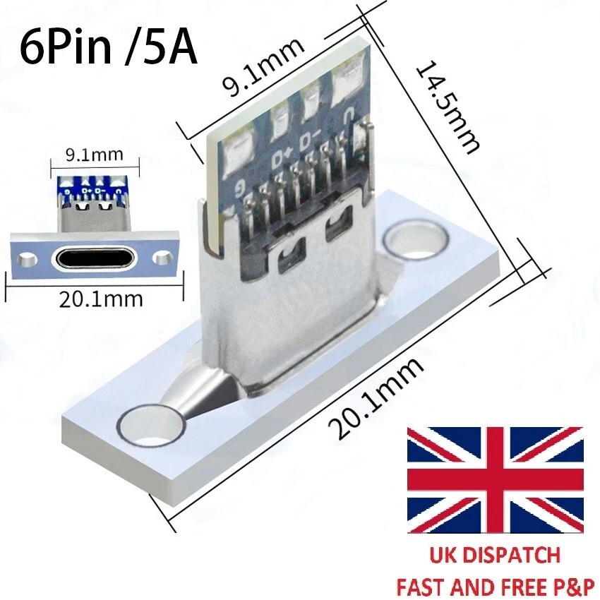

# Plant Station R17 - Assembly Manual

**PLANT-AM-001 / R17 / D02 / 28 September 2026**

Issued for prototype review; physical acceptance open

Current mechanical configuration: R17 integrated body, R16 lid (R15 geometry), R13 fascia and planter. Electrical reference: frozen Uno UI v6 source and 27 September interface record. Fit, powered wet operation and unattended operation remain unaccepted.

## Revision control

- R5-R13 / source history: Earlier assembly and mechanical changes remain traceable through the preserved D01 matrix. Missing document editions are not invented.
- R14 / preceding manual: AM R14 D01: Uno mounting and motor-disabled bench v2. TR's latest located same-family PDF is R13 D01; no TR R14 PDF is assumed.
- R15 / 27 Sep 2026: Reinforced Uno bosses, thicker recessed-head lid and additional pump relief; source changes incorporated at R17, physical trials open.
- R16 / 27 Sep 2026: Four relay bosses below Uno; source change incorporated at R17; actual underside and hole pitch unmeasured.
- UI v6 / 27 Sep 2026: Three buttons and integrated lamps, enabled active-HIGH relay, 1-4 s request, soil display and 60 s backlight timeout. Firmware revision is independent of mechanical R17.
- R17 / 28 Sep 2026: Mounted USB-C cut and pilots, adjacent diameter 10 DC extension hole; estimated dimensions authorised; coupon fit required.
- D02 / 28 Sep 2026: Integrated current R17 document issue. Uses the established enhanced template, controls and cumulative revision bars. No R15/R16 manual issues created.

R5 is the earliest located assembly guide. R1-R4 and R9-R12 PDFs were not located in the previous inventory. R15/R16 are evidenced mechanical prototype changes, incorporated here without fictitious intermediate PDF/manual editions. Margin labels identify documentary changes, not physical test passes.

## 01 Current status and configuration

Actual R17 exported geometry with retained R16 lid and R13 fascia/planter. Components are omitted; this image does not establish fit.

Use this integrated R17 manual for the current prototype build. R15/R16 changes are incorporated here. It replaces R14 instructions for the current assembly, while the R14 documents remain historical evidence.
*Revision labels: R17; change IDs: T17-4.*

**CAUTION:** Prototype status: digital geometry is checked; physical screw, connector, relay, pump-route and leak acceptance remain open. Do not infer those passes from a rendered assembly.

Four main printed parts: R17 integrated body, R16 flush-head lid, R13 fascia and R13 planter. Select one knob variant. There is no separate battery tray or hose clip.
*Revision labels: R10, R13, R15, R17; change IDs: T10-1, T13-1, T15-2, T17-1.*

Terms: Confirmed = current file/check evidence; Reported = operator/source record; Assumed = explicit unmeasured geometry; Unknown = no adequate evidence; Not tested = no physical result. Firmware UI v6 is independent of design R17.

## 02 Printed parts and exact file selection

| Part / qty | File | Use / disposition |
| --- | --- | --- |
| M01 / 1 | tower_sump_body_uno_ports_r17.stl | R17 body; 207 x 100 x 158 mm |
| M02 / 1 | fascia_charcoal.stl (R13) | Retained front panel, nominal 12 mm button holes |
| M03 / 1 | top_cover_flush_r16.stl | R15 lid geometry; 99 x 100 x 5.5 mm; assembled top z163.5 |
| M04 / 1 | planter_sage.stl (R13) | Retained removable planter and two drains |
| M05 / 1 | One measured-shaft knob variant | Choose from R13 knob variants, not all eight |
| T01 / first | power_ports_fit_coupon_r17.stl | 6 thick x 60 x 24; print and fit USB and DC hardware |
| T02 / first | boss_trial_pilot_2p8.stl (R15) | Full-depth screw trial; 3.0 alternative only after recorded failure |
| T03 / first | lid_head_trial_r15.stl | Actual lid screw-head and seating trial |
| T04 / first | pump_route_trial_r15.stl | Actual pump plus attached tubing clearance |
| T05 / first | relay_mount_trial_r16.stl | Actual board, underside, screw and wire access trial |

**CAUTION:** Do not print an older tower or lid alongside this set. The R14 carrier coupon is superseded for the revised boss/pilot acceptance; the R13 ESP32 carrier coupon is not an Uno coupon. Retained dimensions do not close actual fit.

## 03 Hardware, electronics and incoming evidence

| Item / qty | Specification basis | Evidence / action |
| --- | --- | --- |
| Uno / 1 | Classic Uno R3, ATmega328P | Record actual clone/revision and four asymmetric holes |
| Uno screws / 4 | 2.8 x 11 blind pilot; screw dimensions unknown | Trial fastener family/length; do not force a fit |
| Relay / 1 + 4 screws | Nominal 50 x 26 PCB, 44.5 x 20.5 pitch, 3.1 holes | Photo/listing basis only; measure underside and holes |
| Lid / 4 screws | 3.4 through holes; 6.6 x 2.5 head pockets | Head/type/length unknown; use lid coupon |
| Fascia / 4 screws | Retained printed pilots | Prior 3 x 8 thread-forming allocation is provisional |
| LCD / 1 + 4 fixings | 16 x 2 I2C; 75 x 31 centres | Actual backpack/pin markings; M2.5 stack provisional |
| Buttons / 3 | Four-wire momentary illuminated buttons | Identify contacts, LED polarity and current limit separately |
| Potentiometer / 1 | A1 dose control; shaft/nut unknown | Verify terminals and select actual shaft-fit knob |
| USB-C / 1 + 2 screws | Image flange 20.1; PCB 9.1; depth 14.5 | Cut/pitch estimated; panel electrical interface open |
| DC extension / 1 | Requested 10 mm panel cut | Thread, nut, grip range, polarity and cable unknown |
| Pump / 1 + tubing | Separate supply reported 3.5 V | Rated voltage/current, envelope, outlet and tubing unverified |
| Probe / 1 | Installed 447 dry / 221 wet reference | Relative index; verify supply and installed probe |
| Sounder / optional | 10 mm case provision | Type/current unverified; no new wiring approved |
| Holder / optional | Integrated insulated-holder saddle | Cell/charger/power path not accepted; leave cell out |

Use callipers, multimeter, hand drivers, small spanners and appropriate insulated harness tools. Printer, material, layer settings, fastener torque and instrument calibration status are Unknown until recorded. Do not use a powered driver for the printed pilot trials.

## 04 Fit trials and print hold points

1. Print the R17 port coupon. Put its broad 60 x 24 face on the bed, with 6 mm thickness and hole axes vertical. Inspect the slicer orientation and record the resulting bore dimensions.
*Revision labels: R17; change IDs: T17-1.*

2. Fit USB-C and barrel hardware together: flange seats, mounting holes register, USB plug engages fully, DC nut/thread grip spans 6 mm, and both plug bodies and service leads clear. Stop on cracking, forcing or incomplete engagement.
*Revision labels: R17; change IDs: T17-1.*

3. Trial the actual Uno screw in the R15 2.8 mm coupon. Inspect splitting, bottoming, retention, screw projection and board contact. The 3.0 mm trial is an alternative investigation; the R17 body remains 2.8 mm until explicitly regenerated.
*Revision labels: R15; change IDs: T15-1.*

4. Trial lid heads, pump/tube route and four-hole relay registration in their matching coupons. Record the actual screw, component, print material and photographs. These tests can run independently.
*Revision labels: R15, R16; change IDs: T15-2, T15-3, T16-1.*

**CAUTION:** Full-body print hold: resolve failed coupon interfaces, update the CAD parameter/source, rebuild and recheck exports. Slicing, physical manufacturing and acceptance are separate from the supplied digital checks.
*Revision labels: R17; change IDs: T17-4.*

## 05 Uno and relay mounting; flush lid

R16 nominal PCB/component placement, retained inside R17. Proxies show approximate envelopes; this is not a fitted-hardware photograph.

Uno hole centres x/z: (79.75,107.56), (79.75,79.62), (28.95,122.80), (27.68,74.54). Seat plane y76; board faces the removable fascia. Register all four holes without bending the PCB.
*Revision labels: R14; change IDs: T14-1.*

Revised Uno bosses: 8.5 mm tip / 10.0 mm root, 19 mm projection, 2.8 mm nominal blind pilot 11 mm deep from the seat. This addresses the reported R14 splitting but retention and print strength remain untested.
*Revision labels: R15; change IDs: T15-1.*

Relay PCB x21-71 / z33-59, seat y76; contacts to the right, logic terminals left. Hole centres x/z: (23.75,35.75), (23.75,56.25), (68.25,35.75), (68.25,56.25). Bosses match the Uno cone/pilot profile. Check underside solder and actual wires before tightening.
*Revision labels: R16; change IDs: T16-1.*

Lid: 5.5 mm thick with 3.4 mm through holes and 6.6 mm diameter x 2.5 mm deep pockets. Nominal head bearing plane remains z161; top z163.5. Trial head height and engagement, then hand-seat all four screws without distortion.
*Revision labels: R15; change IDs: T15-2.*

## 06 Wet-side pump, tube and sensor routes

Retained R13 route view: separate water tube and pump-wire passages. The lower pump relief is changed by R15; this historical route figure is not a complete R17 section.

With every supply disconnected, remove the planter and fit the actual pump with its tube attached. Reserved pump envelope 38.5 x 25.5 x 43 mm is a reference, not a measured supplied part.
*Revision labels: R6; change IDs: T06-1.*

Feed tube through the 10 mm bore at x123/y92. Feed pump leads through the separate 8 mm bore at x110/y92 and its elevated crossover. Keep the water tube outside the electronics cavity; provide real-part strain relief and respect its bend radius.
*Revision labels: R12; change IDs: T12-1.*

R15 lower relief is x106.5-132, y83-94, z4-52. Sump floor stays 4 mm. Check the actual outlet/tube against the pump-route coupon and assembled body; preserve the dry-side partition.
*Revision labels: R15; change IDs: T15-3.*

Sensor entry is diameter 8, centre y65/z64, lower edge z60. Use the planter service relief, a removable service loop and suitable abrasion/drip protection. Lower edge z60 is a geometric datum, not a fill mark.
*Revision labels: R13; change IDs: T13-4.*

Tie an identified insulated holder into the integrated saddle only if used; slot 6 x 2.5, prior tie assumption 4.8 x 1.5. Keep the locking head accessible and all contacts clear. No cell or charging circuit is accepted by this mechanical provision.
*Revision labels: R11; change IDs: T11-1.*

## 07 Left USB-C and barrel-extension panel

Actual R17 left-wall mesh isolated at x <=6.01 to expose through-holes; other material is clipped for this view.

| Interface | Dimension / position | Status |
| --- | --- | --- |
| USB cut | 9.8 x 4.2; corner radius 1.2; y63/z108.5 | Authorised estimate |
| USB pilots | 2 x diameter 2.8 through; 15.2 pitch | Diameter matches PCB pilot convention; pitch estimated |
| DC hole | Diameter 10.0; y35/z108.5 | User-specified; no added allowance |
| Wall / separation | 6 thick; centres 28 apart along y | Selected placement; actual nut/plug envelopes unmeasured |
| USB flange/PCB/depth | 20.1 / 9.1 / 14.5 | Image labels only; unmeasured actual part |

Mount the flange against the outside wall after the coupon passes. USB screws engage only the 6 mm wall, not an 11 mm blind boss; select length for the flange and check internal tips. Approximately 1.3 mm nominal material separates each pilot from the USB cut. Do not infer thread retention from the matching diameter.
*Revision labels: R17; change IDs: T17-1.*

**CAUTION:** Electrical hold: identify connector pins, USB-C configuration-channel termination, data/power route and DC extension polarity/rating before soldering the installed harness. The image's 6-pin/5 A label is not verified. The cut does not authorise a 9 V connection to USB or a new direct 5 V feed to the Uno.
*Revision labels: R17; change IDs: T17-5.*

## 08 Fascia components, harness and dry closure

Retained R13 fascia and mounting pads. Printed geometry is retained; current control colours/functions are defined by E02, not historical artwork.

Fit the LCD to the 75 x 31 mm pattern behind the 71.4 x 24.6 aperture. Trial the actual fixings, head diameter and backpack stack; no PCB bowing or contact with screw tips.
*Revision labels: R7; change IDs: T07-2.*

Fit the green WATER, yellow NEXT/LAMP TEST and red STOP momentary buttons with their matching nuts. Verify nominal 12 mm holes against real hardware. Fit the potentiometer and select one shaft-fit knob; leave at least 0.5 mm axial clearance. No millilitre scale is valid until measured flow calibration.
*Revision labels: R8, R17; change IDs: T08-4, T17-2.*

The retained sound port/seat and LED collars are mechanical provisions. If used, apply compatible adhesive around case perimeters only; keep light surfaces, sound opening and conductors clear. Electrical type/rating remains unverified.
*Revision labels: R8; change IDs: T08-3.*

Install labelled service loops and insulated joints clear of fasteners. Keep relay contact/pump leads separate from sensitive LCD/probe routes where practicable. Fit fascia, lid and planter by hand; confirm no trapping and full planter removal. No validated screw torque is supplied.

## 09 E01 - LCD, soil probe and dose potentiometer

Current logical route from the recorded Uno interface. Wiring is conditional on identified component ratings; shared return is a branch network, not a series chain.

LCD VCC to regulated Uno 5 V; GND to GND; SDA to A4; SCL to A5. D10 is unconnected. Backlight control uses the I2C backpack while LCD logic stays powered.
*Revision labels: R17; change IDs: T17-2, T17-3.*

Soil AOUT to A0 and dose-pot wiper to A1. Retained probe bench basis is 3.3 V subject to the actual sensor rating; current supply continuity has not been re-measured. Pot outer terminals use 5 V and GND; verify direction and terminals before connection.
*Revision labels: R17; change IDs: T17-2.*

**CAUTION:** Keep pump supply OFF for all logic, upload and LCD checks. Repair intermittent LCD initialisation/write failures before treating the displayed pages as accepted.

## 10 E02 - buttons, LEDs and numbered signal schedule

Function colour and reported lead colour are different attributes. Continuity/polarity must be confirmed for each physical button.

| Wires | From / to | Required identification |
| --- | --- | --- |
| W11 / W12 | D2 / GND -> green WATER switch | Reported red / black leads; INPUT_PULLUP |
| W13 / W14 | D3 / GND -> yellow NEXT/LAMP switch | Reported red / black leads; INPUT_PULLUP |
| W15 / W16 | D4 / GND -> red STOP switch | Reported red / black leads; INPUT_PULLUP |
| W17 / W18 | D5 via limit / GND -> red lamp | Reported green LED+ / yellow LED- |
| W19 / W20 | D6 via limit / GND -> yellow lamp | Reported green LED+ / yellow LED- |
| W24 / W25 | D7 via limit / GND -> green lamp | Reported green LED+ / yellow LED- |
| W23 / W26 | D9 / logic GND -> relay IN1 / GND | Actual terminal labels and trigger current to verify |

**CAUTION:** Each lamp needs its own verified current-limiting arrangement. The old R14 1 kOhm bare-LED example does not qualify the purchased illuminated buttons. Identify built-in limiting or select the external resistor from the actual LED evidence.
*Revision labels: R17; change IDs: T17-2.*

## 11 E03 - relay and complete supply schedule

Logical relay and separate pump supply route. This is not a selected fuse, wire-size, contact-rating or suppression design.

| Wire IDs | Connection | Disposition |
| --- | --- | --- |
| W01-04 | 5 V / GND / A4 / A5 -> LCD | As identified backpack markings |
| W05-07 | Rated probe rail / GND / AOUT-A0 | Prior bench 3.3 V; confirm actual rating |
| W08-10 | 5 V / GND / wiper-A1 -> pot | Verify outer terminals and direction |
| W21 / W22 | Uno 5 V / GND -> distribution | Record branch continuity and total logic load |
| W27 / W28 | Verified relay supply / GND -> module | Coil/input current and supply source unmeasured |
| P01 | Pump supply + -> fuse/disconnect -> COM | Supply/fuse/contact rating requires measurement |
| P02 / P03 | NO -> pump + / pump - -> supply - | Pump separate from Uno rails; NC unused |

D9 is active HIGH in the current source; LOW at normal idle. During reset/bootloader it is high impedance. Measure relay OFF across reset and supply ordering, input current and contact state; provide a proven external default-OFF arrangement if necessary.
*Revision labels: R17; change IDs: T17-2.*

**CAUTION:** STOP cancels the software request. It cannot isolate a welded relay contact or a failed controller. Keep an accessible physical pump-power disconnect and rated protection. Identify the actual motor and suppression before a powered trial.

## 12 USB and barrel extension - open electrical interface

Original user-supplied component image. Labelled geometry is reference evidence; its seller rating and pin functions have not been independently qualified.

The R17 cuts support the intended alternative USB and Uno barrel-input connections. No USB-C solder pin mapping, cable adaptation or DC plug selection is approved by this document. Use the identified onboard USB connection for dry bench checks until A17-07 closes.
*Revision labels: R17; change IDs: T17-5.*

| Required evidence | Close A17-07 by recording |
| --- | --- |
| USB component identity | Exact variant, connector pin map and measured shell/flange/fixing dimensions |
| USB power/data route | Continuity, configuration-channel termination, intended data capability and supply compatibility |
| Barrel extension | Actual mating sizes, polarity continuity, rated cable/current and 6 mm panel grip |
| Supply arrangement | Selected voltage for each board input, regulation/load evidence and intended one-source procedure |
| Acceptance | Measured idle/load rails, no unwanted source coupling, insulated strain relief and retained wiring diagram |

Owner: Unassigned. Target: Not set. Do not assume the phrase '9 V battery connection' specifies the purchased extension, its polarity or an accepted supply.

## 13 Firmware identity and operator behaviour

Frozen electrical reference: PlantUno UI v6 for arduino:avr:uno. The supplied source enables RELAY_ENABLED=true and ActiveHigh on D9, with 1,000-4,000 ms request limits, sampled from A1 at WATER start. This manual does not upload or change firmware.
*Revision labels: R17; change IDs: T17-2, T17-3.*

| Control / state | Current source behaviour | Physical evidence |
| --- | --- | --- |
| Green WATER | One bounded request; knob sampled once; release does not cancel | Actual duration/volume not measured |
| Yellow button | Idle pages Status/Raw/Session; hold lamp test; cancels dose | Full pages and lamp behaviour open |
| Red STOP | Cancels; release required to re-arm; hold 2 s clears volatile counters | Software cancellation, not isolation |
| Moisture | Below 25% red blink; at/above 25% green; 500 ms stability | Relative calibrated index, not volumetric moisture |
| A0 raw <=20 | Fault indication; green OFF; CHECK SOIL A0 | Fault classification is not a pump interlock |
| Pump request ends | Immediate soil Status return; sensor fault remains explicit | Post-dose physical screen observation open |
| Backlight | 60 s idle off; buttons or >=8 ADC knob counts wake; pump stop restarts timer | Serial OFF/ON recorded; visual and post-dose timer open |

The 27 September upload record reports COM8, 14,950 flash bytes and 870 global RAM bytes. Current frozen source hash matches that record. LCD status 0 and serial idle-OFF/activity-ON were recorded; previous LCD faults remain unresolved. These are historical records, not new tests performed for this manual.
*Revision labels: R17; change IDs: T17-4.*

**CAUTION:** Re-detect the board/port if uploading later; obtain confirmation that the separate pump supply is OFF. Keep the two header files with the sketch and use the correct board profile. No sensor state initiates automatic watering.

## 14 Dry commissioning and stop criteria

Use PLANT-TS-001 R17 D02 for actual results. All supplies remain disconnected during continuity, contact, screw and strain-relief inspections. Pump supply stays OFF for powered logic and display checks.

Verify each switch pair open/released and closed/pressed, each lamp polarity/limiting, LCD wiring and probe/pot connections. Record actual parts and voltages. Stop on uncertain pin labels, current limits or supply polarity.
*Revision labels: R17; change IDs: T17-2.*

With pump supply OFF, confirm serial identity, relay request OFF at idle, stable LCD status 0 and no write failures. Check all three switches, page navigation, lamp test, STOP/release, A1 endpoints, 25% indications and the rail-low fault using a safe identified test arrangement.
*Revision labels: R17; change IDs: T17-3.*

Observe 60 s backlight idle-off and button/knob wake; separately observe full 60 s after completed/cancelled requests. Confirm the soil Status page returns immediately on request end. Serial acknowledgement alone does not accept the actual LCD.
*Revision labels: R17; change IDs: T17-3.*

**CAUTION:** Stop on an unexpected relay contact closure, LCD fault, overheating, loose wiring, damaged printed support or trapped service lead. Record the defect and keep affected power isolated until corrected.

## 15 Wet acceptance, operation and care

Electrical/pump acceptance, material qualification and leak/fill testing are prerequisites for supervised wet trials. Define the method, maximum fill candidate and duration before recording a pass. No accepted fill volume exists here.

With electronics removed or independently protected, test the actual printed sump for leakage and inspect dry boundaries. Verify drain-back headspace, both planter drains, riser behaviour, tube retention and splash/tilt ingress. Sensor lower edge z60 and sump rim are not approved fill marks.
*Revision labels: R13; change IDs: T13-4.*

After ratings/protection/default-OFF checks, measure separate-supply pump contact timing and delivery at 1.0 and 4.0 s settings with the installed lift and tube. Define allowable duration/volume error from the intended requirement; those tolerances are not yet set.
*Revision labels: R17; change IDs: T17-4.*

Before each accepted supervised use inspect water, tube, drains, visible leaks and supply leads. Isolate all power before moving, cleaning or removing the planter. Empty before moving and support the complete base; do not immerse the electronics tower.

Remove soil debris from both drains and pump inlet. Use cleaning materials and temperature limits compatible with the qualified print material. No unattended-operation approval or water-ingress rating is claimed.

## 16 Build record, open actions and source map

| Build field | Actual recorded value |
| --- | --- |
| Build ID / operator / date | ________________ / Unknown |
| Actual PCB / relay / pump identities | ________________ / Unknown |
| Printer / material / slicer / saved job | ________________ / Unknown |
| STL hash / source issue / orientation | ________________ / Unknown |
| Fastener family / measured dimensions | ________________ / Unknown |
| USB/DC component and wiring evidence | ________________ / Unknown |
| Physical fit / leak / fill evidence | ________________ / Unknown |
| Duration / volume results and tolerances | ________________ / Unknown |
| Defects / deviations / action closure | ________________ / Unknown |
| Reviewer / date / disposition | ________________ / Unknown |

A17-01 through A17-13 are the shared acceptance IDs in PLANT-TS-001. Owner: Unassigned; targets: Not set. Blank fields are Unknown, never passes. Record evidence and explicit disposition before closing an action.
*Revision labels: R17; change IDs: T17-4.*

Sources: R13 retained CAD/readme; R14 Uno mounting evidence; R15 DESIGN_REVIEW and verification; R16 REVIEW and verification; R17 parameters, checks and attached image; current Uno sketch/headers; 27 September interface/upload record. The package contains frozen source copies, SHA-256 register and selected printable files.

Change bars use the verified control matrix. R17 electrical bars mean newly incorporated manual content from 27 September; they do not claim that UI v6 originated in the 28 September mechanical revision. R1-R4 and absent intermediate PDF editions remain undocumented.
