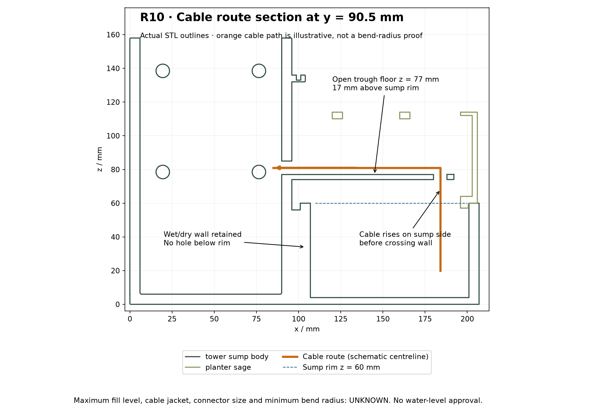

# R10 integrated tower and sump

Current baseline: R9, verified from the checkout. R10 replaces the separate tower and sump with **tower_sump_body.stl / .step**, one printable solid, and updates the planter to clear an internal cable trough. The fascia, roof, battery tray, hose clip and knob choices retain R9 geometry. Six main assembly parts; 21 total STL/STEP exports including accessories and coupons.

## Geometry and assumptions

Units mm; original common assembly coordinates retained: x right, y rear, z up. Overall assembly remains 207 × 100 × 161 mm. The combined body alone is 207 × 100 × 158 mm.

- Solid web occupies the former inter-part gap, x94–107, y8–92, z0–56. Both water-containing walls and the sump floor remain. The former dovetail interface is absorbed into this continuous body; no slide assembly is required.
- Sump rim: z60; floor z4. **No opening through the sump-to-electronics wall below the rim.**
- Internal open trough: x94–192, y85.5–95.5, z74–86; clear width 6, floor top z77. It crosses the wall 17 mm above the sump rim.
- Cable rises on the sump side at x184/y90.5 through an 8 mm entry hole in the elevated trough floor. It runs left inside the rear service space and enters the tower through an 8 mm bore centred at y90.5/z81.
- Planter rear service relief: x101–193/y85–96/z56–126. It clears the fixed trough during vertical removal. The soil cavity ends at y80 and remains separate; the existing drains remain. Additional relief at x101–105/y84–101 clears the retained hose-clip shelf during lifting. Two upper ribs at x120–126 and x160–166, y82–98/z110–114 retain the rear skirt as one solid, above the cable trough.
- Provisional cable jacket OD: **4 mm**. Cable connector size, stiffness, minimum bend radius and retention arrangement are **unknown**. Route a loose end before termination; no claim that a moulded plug passes through the route. The depicted square turn is a schematic, not an approved cable bend.
- Maximum operating water level is **unknown**. The rim is a geometric reference, not a fill mark. Allow for drain-back, splash and tilt after physical testing. This route is not a waterproof gland, capillary break or ingress-protection rating.

## Assembly change

1. Print the combined body and revised planter. Use existing R9 fascia, roof, battery tray and hose clip. Inspect slicing/supports under the elevated trough and at its entry hole before printing; no slicing has been performed.
2. Clear support material, inspect the trough and both cable openings, and confirm the selected cable fits without abrasion. Deburr entry edges as required; use suitable retention/edge protection after measuring the cable.
3. With electronics and planter removed, test the sump for leaks, including the former joining area. Keep the dry cavity empty during the test. Establish an operating fill limit allowing for drain-back; no fill level is authorised by this design.
4. Place the pump, bring its cable upwards through the existing sump-side service space and through the elevated trough entry at x184/y90.5. Leave a downward loop on the wet side; lead the loose cable end left along the trough and through the tower-side bore. Confirm the actual bend radius and provide strain relief independently of the printed openings.
5. Fit the planter vertically over the relieved service area, checking that it neither pinches nor drags the cable. Verify removal again with the cable installed. The trough is an integral bridge and must not be bent aside to insert the planter.
6. Continue the [R8 illustrated assembly guide](../../docs/ASSEMBLY_GUIDE_R8.md) for controls, carrier, battery tray and roof, using R9 dimensional/edge corrections and this R10 base/route change. The old tower-to-sump dovetail assembly step is superseded.

## Validation

See `verification.json`, `independent_mesh_check.json` and `step_check.json`. Checks cover single-solid continuity, positive gap-fill probe, retained full-height wet/dry wall, a connected provisional 4 mm cable envelope, main-part intersections and planter lift positions at 2 mm increments over 120 mm. Discrete lift checks are not a continuous-motion or cable-flexibility proof. `cable_section.png` comes from actual STL outlines at y90.5 with an illustrative cable centreline.

The known CadQuery shutdown anomaly remains: CAD and STEP assertions report PASS then the process exits 1. Independent mesh checks run without CadQuery and must exit 0. Physical fit, support removal, strength, cable abrasion/retention, leak and electrical tests remain outstanding.

## Rebuild and explore

Run `python mechanical/concept_rev10/build.py`, `python mechanical/concept_rev10/check_exports.py`, `python mechanical/concept_rev10/check_step.py` and `python mechanical/concept_rev10/render_cable_section.py` from the repository root. Dependencies follow R9; section rendering also uses Matplotlib.

[Interactive explorer instructions](viewer/README.md). STL files use common assembly coordinates; move each selected print to the bed without scaling.
