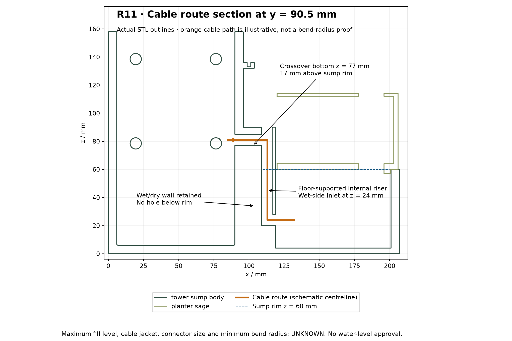
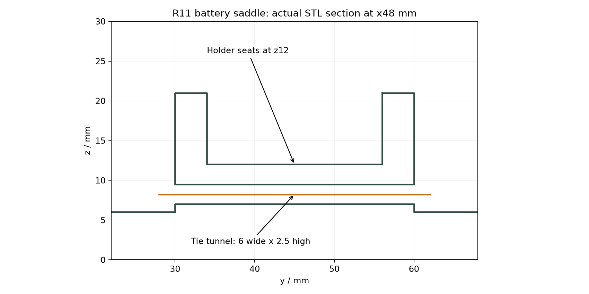

# R11 supported cable riser and integrated battery saddle

Replaces the rejected R10 cantilevered cable trough with a short upright passage built into the sump floor, divider and rear wall. The tower, sump and battery-holder saddle are now **one printable solid**, `tower_sump_body.stl` / `.step`. Five main parts, 20 total STL/STEP files including accessories and coupons.

## Cable route

All dimensions in mm, original x/right, y/rear, z/up coordinates. Combined body remains 207 × 100 × 158; assembled height with roof 161.

- Compact riser envelope: x94–119, y84–97, z4–90. It is attached continuously to the floor and adjacent walls; the long span across the sump is removed.
- Vertical passage: 8 mm bore at x113/y90.5, open at the top for threading. Wet-side inlet: 8 mm, centred at z24, opening towards the sump.
- Upper crossover: 8 mm bore, centred at y90.5/z81, into the tower. Its lowest point is z77: **17 mm above the z60 sump rim**. The wet/dry divider remains solid below the rim. The riser itself can contain water up to the sump water level; it is not a sealed conduit.
- Cable jacket OD provisionally 4 mm. Actual connector, minimum bend radius and stiffness are unknown. The two turns require a physical threading and bending trial; the open top provides access for a pull wire. No moulded-connector fit is claimed.
- Planter uses a local rear-left relief, x101–120/y83–101/z56–126. The R10 long relief and extra spanning ribs are removed. The soil cavity remains unchanged; its rear wall retains at least 3 mm nominal thickness at the relief. Lift clearance is checked at 2 mm increments through 120 mm.

Maximum fill level is **unknown**. The rim is a geometry reference, not a fill mark. Verify drain-back, splash, tilt and cable wicking during commissioning. This is not a waterproof gland, capillary break or ingress-protection rating.

## Battery-holder saddle and tie

The previous tray is fused to a continuous floor pedestal. It still receives an **insulated battery holder**, not bare electrical cell contacts. Usable space between rails remains 72 × 22 mm with the seating floor at z12 and rails to z21. Actual holder fit is unverified.

- One transverse slot: **6 mm wide × 2.5 mm high**, x45–51, through y29–61, z7–9.5.
- Provisional tie: up to 4.8 mm wide × 1.5 mm thick; actual tie head size and bend behaviour unknown. Slot endpoints are accessible outside the side rails. The roof above the slot is 2.5 mm nominal at the holder seating surface.
- Thread the tie through the slot before inserting the insulated holder. Wrap it around the holder, position the head away from contacts and wiring, and tighten only enough to restrain the holder. Confirm the tie cannot crush or abrade the cell/holder.
- Old floor-pad voids are filled. The two existing holder access holes remain optional; no separate tray mounting step or tray STL is required.

## Revised assembly sequence

1. Inspect the combined-body slice, especially the 6 mm tie-slot bridge, horizontal cable bores and carrier supports. No slicing or printing has been performed by this revision.
2. Clear supports and test the tie slot and riser with the actual tie/cable. Remove sharp print debris and verify bend radius; do not force a terminated plug through.
3. With electronics absent, test the sump and riser for leaks, including the retained divider. Establish an operating fill limit allowing for drain-back.
4. Install the pump. Feed its loose cable end into the sump-side riser inlet, pull upwards using the open top, then route through the upper crossover into the tower. Provide measured strain relief and verify the cable bends without kinking or abrasion.
5. Thread the battery tie, seat the insulated holder and restrain it. Verify polarity/contact isolation independently; this geometry does not define battery charging or protection circuitry.
6. Lower the revised planter over the local riser relief and verify removal without pinching the cable. Fit existing fascia, roof and hose clip using the prior control/electronics guidance.

Use the [R8 illustrated guide](../../docs/ASSEMBLY_GUIDE_R8.md) for unchanged electronics and controls; the separate tower/sump/tray and R10 trough steps are superseded by this page.

## Evidence and rebuild

`verification.json`: CAD continuity, retained wall, cable/tie path, tie-roof material, holder space and planter lift checks; five main parts and ten intersection pairs. `independent_mesh_check.json`: exported meshes and critical sections. `step_check.json`: reopened solid counts and STL agreement. `cable_section.png` uses actual exported outlines with a schematic route.

Known CadQuery shutdown issue: passing assertions may be followed by process exit 1. The independent mesh checker runs separately and must exit 0. Physical cable/tie/holder fit, slicing, print strength, leaks and electrical operation remain unverified.

From the repository root, run `python mechanical/concept_rev11/build.py`, then `check_exports.py`, `check_step.py` and `render_cable_section.py` from that directory using the same Python environment described in R9. [Interactive explorer instructions](viewer/README.md).
