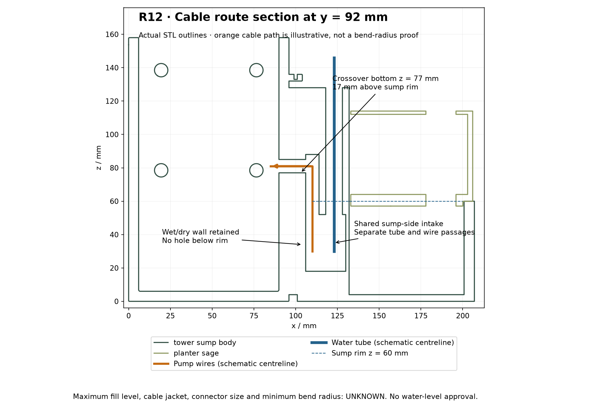
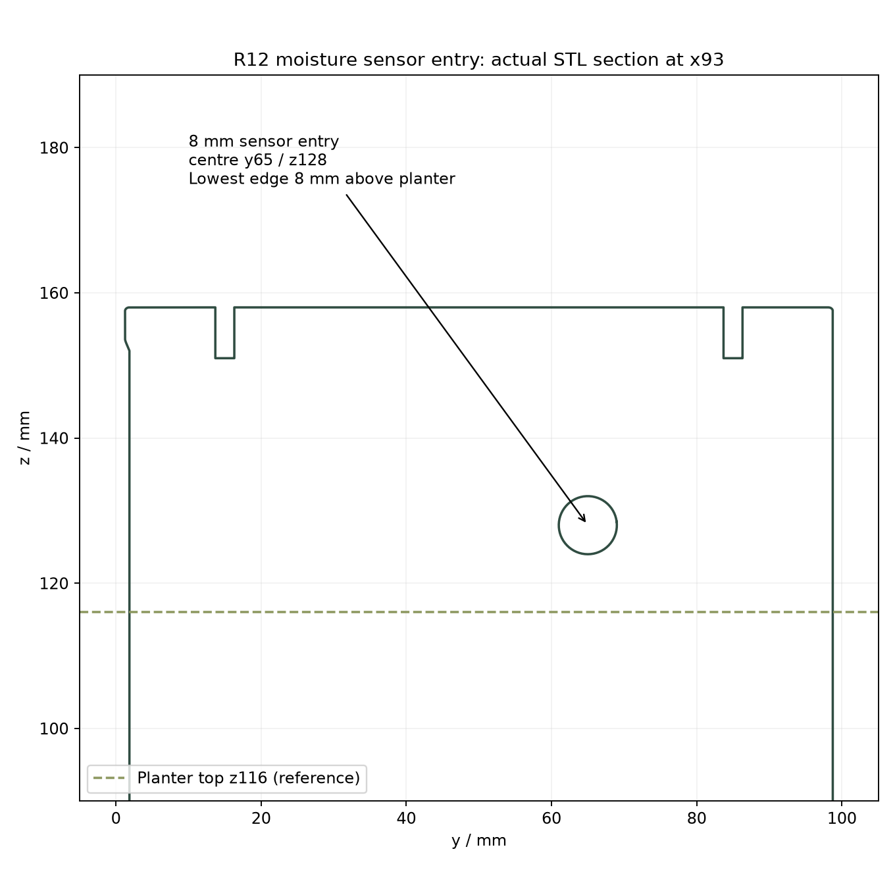

# R12 tube, pump-wire and moisture-sensor routing

The R11 8 mm cable-only riser is superseded. R12 has a larger floor/wall-supported service area with a shared sump-side intake and **separate water-tube and pump-wire passages**. An independent moisture-sensor entry is above the planter. The tower, sump and battery saddle remain one printable solid; five main parts and 20 STL/STEP exports.

## Route dimensions — mm

Datums retained: x right, y rear, z up. Body 207 × 100 × 158; roof height 161; planter top z116; sump rim z60.

| Feature | R12 geometry | Intended service / evidence |
|---|---|---|
| Common sump intake | x106.5–130, y83–94, z18–52: 23.5 wide × 34 high | Shared access to tube and wire routes; open to sump water |
| Tube passage | 10 mm bore, centre x123/y92, exits upwards at z128 | Provisional 8 mm OD tube; outlet 12 mm above planter top |
| Pump-wire passage | 8 mm bore, centre x110/y92 | Two provisional 2.5 mm OD insulated wires |
| Pump-wire crossover | 8 mm bore into tower, centre y92/z81 | Lowest point z77, 17 mm above sump rim; tube does not enter tower |
| Moisture-sensor entry | 8 mm through right tower wall, centre y65/z128 | Lowest point z124, 8 mm above planter; provisional 4 mm lead envelope |
| Supported service column | x94–132, y84–100, z4–128 | Continuous floor/wall attachment; no spanning cantilever |
| Planter service clearance | x101–133, y83.5–101, z56–132 | Local relief; original soil cavity and drains retained |
| Integrated battery tie slot | 6 × 2.5 mm, x45–51/y29–61/z7–9.5 | Retained from R11; provisional tie 4.8 × 1.5 mm |

The nominal wall between the two vertical bores is 4 mm. The local planter relief retains at least 3.5 mm nominal rear soil-wall thickness. The maximum water level is unknown: rim height is a geometric reference, not an approved fill mark. The sump-side intake and lower riser can contain water. The divider remains solid below the rim; these are not sealed glands or a capillary barrier.

**Actual tube OD, wire insulation diameter, sensor connector, tube minimum bend radius and strain relief remain unconfirmed.** Dimensions above are design assumptions pending the user's measurements. An 8 mm hole does not establish that a moulded sensor connector fits. Route unterminated/appropriately detachable leads; do not cut an actual cable without checking its construction and termination requirements.

## Assembly changes

1. Print the R12 combined body and R12 planter. Reuse the R11 fascia, roof and hose clip. The integrated battery saddle and tie slot remain unchanged.
2. Inspect the slice for the enlarged inlet roof, crossover and sensor-hole roofs, and tie tunnel; remove all support/debris before feeding services. No slicing has been performed here.
3. With the planter and electronics removed, route the pump tube through the common sump opening and the **right-hand 10 mm vertical bore** at x123. Bring it out at the top and curve it towards the plant. Keep the complete water tube outside the electronics space; confirm the actual bend radius and outlet retention.
4. Lead the two pump wires through the same sump-side access opening into the **left-hand 8 mm bore** at x110, then through the upper crossover into the tower. The diagram is a schematic centreline; the real turns and strain relief require a fit trial.
5. Route the moisture-sensor lead separately through the 8 mm tower entry above the planter. Provide slack for probe/planter removal, a drip loop and suitable edge protection/strain relief based on the real lead.
6. Thread the battery tie under the integrated saddle, install the insulated holder and verify that the tie avoids contacts and does not crush the holder. Fit the planter and verify removal without pulling or pinching any service.
7. Complete controlled leak, drain-back, tilt/splash, cable/tube retention and electrical checks before powered wet use. Establish an operating water level from those tests.

R11 integrated-holder guidance remains applicable; the R11 narrow cable riser instructions are superseded. Older electronics/control guidance remains provisional and unchanged.

## Validation and outputs

See `verification.json` for tube, two-wire and sensor clearance probes, retained divider/support checks, holder/tie checks and 61 discrete planter lift checks (2 mm steps through 120 mm). `independent_mesh_check.json` validates all exported meshes, the 10/8 mm riser sections, 8 mm sensor entry and tie slot. `step_check.json` reopens the STEP solids. Section illustrations come from actual final STLs; route lines do not prove tube flexibility or cable bend radius.

Known CadQuery shutdown exit 1 occurs after passing CAD/STEP assertions; independent mesh checking exits 0. No physical fit, slicing, strength, leak or electrical-operation approval is claimed.

Rebuild using `build.py`, `check_exports.py`, `check_step.py` and `render_cable_section.py` in this directory, following the R11 runtime instructions. [Interactive explorer](viewer/README.md).
